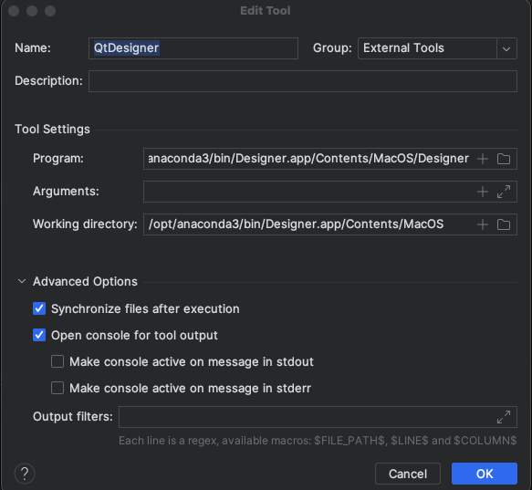
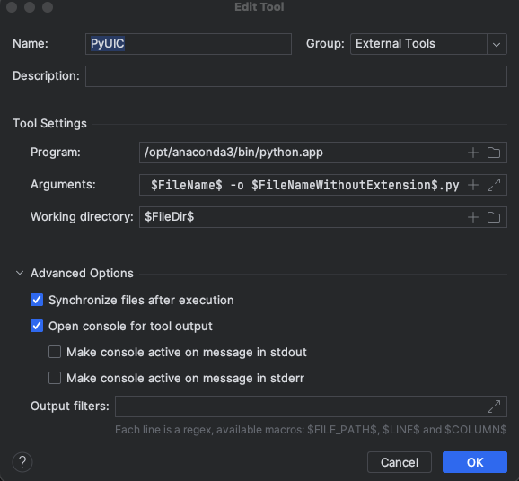

# **python学习**

## 生成器的使用

### 	1、 迭代器

​		生成器函数的使用场景可以等待yield返回时直接操作，可以再迭代器__next__()中间进行操作

### 	2、生产者消费者

​		使用send(self,value)方法可以给消费者发送消息，继续向下执行，与使用__next__()相似，但是可以传递参数

## 装饰器

​		

## logging模块

​		longging模块实例

```python
import logging

FORMAT = '%(asctime)s - %(filename)s - [%(lineno)d] - %(message)s'

logging.basicConfig(
    level=logging.DEBUG,
    filename='logging_test.log',
    filemode='w',
    format=FORMAT

)

logging.debug('debug message')
logging.info('info message')
logging.warning('warning message')
logging.error('error message')
logging.critical('critical message')

#使用日志对象的方式

logger = logging.getLogger()

fh = logging.FileHandler('test.log')
ch = logging.StreamHandler()
fm = logging.Formatter('%(asctime)s - %(name)s - %(levelname)s')

logger.addHandler(fh)
logger.addHandler(ch)
fh.setFormatter(fm)
ch.setFormatter(fm)

logger.setLevel('DEBUG')

logger.debug('debug message')
logger.info('info message')
logger.warning('warning message')
logger.error('error message')
logger.critical('critical message')
```

```python
#创建相同的对象，在同一个节点
import logging

### 获取名为 'test' 的日志记录器

logger1 = logging.getLogger('test')
logger2 = logging.getLogger('test')

# 检查两个变量是否指向相同的对象

print(logger1 is logger2)  # 输出: True

# 默认情况下，获取的是 'root' 日志记录器

default_logger1 = logging.getLogger()
default_logger2 = logging.getLogger()
print(default_logger1 is default_logger2)  # 输出: True
```

```python
#创建不同的对象，存在继承的关系
import logging

# 创建父记录器

parent_logger = logging.getLogger('parent')
parent_handler = logging.StreamHandler()
parent_logger.addHandler(parent_handler)
parent_logger.setLevel(logging.DEBUG)

# 创建子记录器

child_logger = logging.getLogger('parent.child')
child_logger.setLevel(logging.ERROR)  # 只记录ERROR及以上级别的日志

# 子记录器会使用父记录器的handler，但具有不同的日志级别

parent_logger.debug('This is a parent debug message.')
child_logger.error('This is a child error message.')
child_logger.debug('This debug message will not show.')
```

```python
在 Python 中，当你创建一个 logger 并设置它的子记录时，子记录会沿用父记录的配置。这意味着如果父记录设置了某些处理程序 (handler) 或者格式 (format)，子记录会继承这些配置。

通常情况下，子记录会执行其自己的记录，但是在执行时也会受到父记录的影响。这意味着当子记录输出日志消息时，它会按照父记录的配置进行处理。

以下是一个简单的例子，演示了一个父记录和它的子记录。在这个例子中，子记录沿用了父记录的配置：
import logging

# 创建父记录

logger_parent = logging.getLogger('parent')
logger_parent.setLevel(logging.DEBUG)
formatter = logging.Formatter('%(asctime)s - %(name)s - %(levelname)s - %(message)s')
console_handler = logging.StreamHandler()
console_handler.setFormatter(formatter)
logger_parent.addHandler(console_handler)

# 创建子记录

logger_child = logging.getLogger('parent.child')

# 输出日志消息

logger_parent.debug('This is a message from the parent logger')
logger_child.debug('This is a message from the child logger')

在上面的例子中，即使我们只在子记录上调用了 debug 方法，父记录的处理程序和格式仍然会影响子记录的输出。要避免这种情况，您可以在创建子记录时，手动地配置它的处理程序和格式，使其与父记录区分开来。
补充：装饰器可以是方法，也可以是类
```

## configparse模块

configparser 模块是 Python 中用于处理配置文件的内置模块。它可以帮助你解析和操作 INI 风格的配置文件。下面是一个简单的示例，演示了如何使用 configparser 模块：

假设有一个名为 `config.ini` 的配置文件，内容如下：

```ini
[settings]
name = Alice
age = 30
email = alice@example.com
```

下面是代码示例，展示了如何使用 configparser 模块解析配置文件的值：

```python
import configparser

# 创建 ConfigParser 实例
config = configparser.ConfigParser()

# 读取配置文件
config.read('config.ini')

# 获取配置文件中的值
name = config.get('settings', 'name')
age = config.getint('settings', 'age')
email = config.get('settings', 'email')

# 打印配置值
print(name)   # 输出：Alice
print(age)    # 输出：30
print(email)  # 输出：alice@example.com
```

在上面的示例中，我们首先创建了一个 ConfigParser 实例，然后使用它的 `read` 方法加载配置文件。接着我们使用 `get` 方法来获取配置文件中的值，这里我们使用了 `getint` 方法来获取整数类型的值。

除了上述方法，configparser 还提供了其他方法来操作配置文件中的值，比如 `sections` 方法用于返回配置文件中所有节的列表，`options` 方法用于返回指定节中所有选项的列表，以及 `set` 方法用于更新或创建配置文件中的值。

希望这个示例能帮助你了解如何使用 configparser 模块。如有任何疑问，欢迎与我进一步交流。


## 面向对象类

当使用 Python 类时，你可以先定义类，然后创建该类的实例，最后使用这些实例调用类中的方法和访问属性。以下是一个简单的示例，演示了如何定义一个类、创建实例以及使用实例：

```python
# 定义一个简单的类
class Dog:
    # 初始化方法
    def __init__(self, name, age):
        self.name = name
        self.age = age
    
    # 实例方法
    def bark(self):
        return "Woof!"

# 创建类的实例
my_dog = Dog("Buddy", 3)

# 使用类的实例
print(my_dog.name)  # 输出：Buddy
print(my_dog.age)   # 输出：3
print(my_dog.bark())  # 输出：Woof!
```

在上面的示例中，我们定义了一个名为 `Dog` 的类。在类中，我们有一个 `__init__` 方法用于初始化属性，以及一个 `bark` 方法来表示狗叫声。然后，我们创建了 `Dog` 类的实例 `my_dog`，并使用它来访问实例属性和调用实例方法。

你也可以在类的实例上调用其他方法，更新实例的属性，甚至创建多个不同的实例来代表不同的对象。


查看类属性

可以是用类的字典调用类中的属性

```
Dog.__dict__ #类的字典
Dog.__dict__['bark']() #直接调用类的方法

#特殊的类属性
print(Dog.__name__) #类的名字(字符串)
print(Dog.__doc__) #类的文档字符串
print(Dog.__module__) #类的定义所在的模块(字符串)
print(Dog.__bases__) #类的所有父类构成元素的元组
print(Dog.__base__) #类的第一个父类
print(Dog.__dict__) #类的属性和方法的名字(字符串)的集合
print(Dog.__class__) #类的类(type)

print(my_dog.__dict__) #实例的属性和方法的名字(字符串)的集合
```

## 类静态属性和方法

### @property

在 Python 中，`@property` 是一个装饰器，用于将类的方法转换为属性，从而可以在访问方法时使用属性访问的方式。这样做的好处是在不改变类接口的情况下，可以对属性进行更多的控制，比如数据验证、计算新值等操作。

下面是一个使用 `@property` 的示例，详细演示了如何定义和使用：

```python
class Circle:
    def __init__(self, radius):
        self._radius = radius  # 注意这里使用了一个下划线开头的变量名来表示私有属性

    @property
    def radius(self):
        """获取半径"""
        return self._radius

    @radius.setter
    def radius(self, value):
        """设置半径，同时更新面积"""
        if value <= 0:
            raise ValueError("半径必须大于0")
        self._radius = value

    @property
    def area(self):
        """计算面积"""
        return 3.14 * self._radius ** 2

# 创建 Circle 的实例
c = Circle(3)

# 调用属性访问
print(c.radius)  # 输出：3
print(c.area)    # 输出：28.26

# 修改属性
c.radius = 5
print(c.radius)  # 输出：5
print(c.area)    # 输出：78.5

# 尝试设置无效的属性值
try:
    c.radius = -2  # 将半径设为负数，会触发异常
except ValueError as e:
    print(e)  # 输出：半径必须大于0
```

在上面的示例中，我们定义了一个 `Circle` 类，使用 `@property` 定义了 `radius` 和 `area` 两个属性。`@radius.setter` 装饰器用于指定设置属性时的行为。这样一来，我们就可以直接通过 `c.radius` 和 `c.area` 的方式访问这两个属性，而不是显式地调用方法。

`@property` 装饰器为属性提供了更大的灵活性，使得我们可以定制属性的读写行为，而不必直接暴露属性的获取和设置方法。


### `@classmethod` 

在 Python 中，`@classmethod` 是一个装饰器，用于指示一个方法是类方法。类方法与实例方法不同，类方法的第一个参数通常为类本身，通常被命名为 `cls`。类方法可以通过类本身来调用，而不需要实例化类。

下面是一个详细的示例，演示了如何使用 `@classmethod`：

```python
class MyClass:
    class_variable = 10  # 类变量

    def __init__(self, x, y):
        self.x = x  # 实例变量
        self.y = y  # 实例变量

    @classmethod
    def from_string(cls, string):
        # 解析字符串并创建对象
        x, y = map(int, string.split(','))
        return cls(x, y)  # 返回类的实例

# 使用类方法创建对象
obj = MyClass.from_string('5,7')
print(obj.x)  # 输出：5
print(obj.y)  # 输出：7
```

在上面的示例中，我们定义了一个名为 `from_string` 的类方法，它接受一个字符串参数，并返回类的实例对象。在类方法内部，我们使用 `cls` 参数来创建并返回类的实例。

在实际应用中，类方法通常用于提供多种构造对象的方式，或者在不需要访问实例属性的情况下执行一些与类相关的操作。

通过 `@classmethod` 装饰器，我们可以明确地指示某个方法是类方法，以便在设计和使用类时能够清晰地表达意图。


### @staticmethod

在 Python 中，`@staticmethod` 是一个装饰器，用于创建静态方法。静态方法与类方法和实例方法不同，它不需要访问类或实例的任何属性或方法，因此不需要传入 `self` 或 `cls` 参数。

下面是一个详细的示例，演示了如何使用 `@staticmethod`：

```python
class MathUtil:
    @staticmethod
    def add(x, y):
        return x + y

    @staticmethod
    def multiply(x, y):
        return x * y

# 调用静态方法
sum_result = MathUtil.add(3, 5)
product_result = MathUtil.multiply(3, 5)
print(sum_result)  # 输出：8
print(product_result)  # 输出：15
```

在上面的示例中，`add` 和 `multiply` 方法都被定义为静态方法，因此它们可以直接通过类来调用，而不需要先创建类的实例。在静态方法内部，我们不需要使用 `self` 或 `cls` 参数，因为静态方法不涉及实例或类的状态。

通常来说，静态方法用于与类相关的功能，但这些功能并不需要访问类或实例的属性。它们类似于全局函数，但包含在类的命名空间中。

通过 `@staticmethod` 装饰器，我们可以明确地指示某个方法是静态方法，以便在设计和使用类时能够清晰地表达意图。


## 类的组合

在 Python 中，组合指的是一个类包含另一个类的对象作为自己的成员。这种关系被称为“has-a”关系，表示一个类“拥有”另一个类的对象。组合允许一个类使用另一个类的功能，同时仍保持了类之间的独立性。

下面是一个示例，演示了如何在 Python 中使用组合：

```python
# 定义一个简单的类
class Engine:
    def start(self):
        print("Engine started")

class Car:
    def __init__(self):
        self.engine = Engine()  # 在Car类中包含一个Engine类的对象作为其属性

    def start(self):
        print("Car starting")
        self.engine.start()  # 调用Engine类对象的方法
```

在上面的示例中，`Car` 类包含一个 `Engine` 类的对象作为属性。这种关系表示 `Car` 类“拥有”一个 `Engine` 对象。当 `Car` 类的 `start` 方法被调用时，它可以通过它自己的 `engine` 属性来调用 `Engine` 类的 `start` 方法。

使用组合的优势在于它能够将功能划分成更小的部分，并且可以更方便地重用这些功能。同时，它还能保持类之间的独立性，避免了过度耦合。

另外，组合也使得代码更容易扩展和维护。如果 `Engine` 类发生改变，只需修改 `Car` 类中对 `Engine` 类的使用即可，而不需要修改 `Engine` 类本身。


课程选择应用实例

```python
class School:
    def __init__(self,name,location):
        self.name = name
        self.location = location

class Course:
    def __init__(self,name,price,period,school):
        self.school = school
        self.name = name
        self.price = price
        self.period = period


s1 = School("python","北京校区")
s2 = School("java",'上海校区')
s3 = School("c",'东京校区')

msg = '''
1 python 北京校区
2 java 上海校区
3 c 东京校区
'''

while True:
    print(msg)
    menu = {
        "1": s1,
        "2": s2,
        "3": s3
    }
    choice = input("请输入您的选择：")
    school_obj = menu[choice]

    name = input("课程名>>:")
    price = input("课程费用>>:")
    period = input("课程周期>>:")

    new_course = Course(name, price,period,school_obj)
    print('课程【%s】属于【%s】学校' %(new_course.name,new_course.school.name))
```


## 继承

在 Python 中，继承是面向对象编程中常用的概念，允许一个类（子类）继承另一个类（父类）的属性和方法。子类可以使用父类的所有公共方法和属性，同时可以根据需求添加新的方法和属性。

下面是一个示例，演示了如何在 Python 中使用继承：

```python
# 父类
class Animal:
    def __init__(self, name):
        self.name = name

    def make_sound(self):
        pass  # 抽象方法

# 子类继承父类
class Dog(Animal):
    def make_sound(self):
        return "Woof!"

# 创建子类的实例并调用方法
my_dog = Dog("Buddy")
print(my_dog.name)       # 输出：Buddy
print(my_dog.make_sound())  # 输出：Woof!
```

在上面的示例中，`Animal` 类是父类，`Dog` 类是子类，使用了`(父类)`来实现继承。子类会继承父类的 `__init__` 方法以及其他方法。在这个例子中，`Dog` 类重写了父类的 `make_sound` 方法，并添加了自己的实现。

继承的好处在于它提供了代码重用的机制，同时也使得代码结构更加清晰和易于维护。子类可以借助继承来扩展父类的功能，同时保留了父类的特性。

还需要注意的是，Python 支持多重继承，一个子类可以继承多个父类。这种特性使得开发者能够更加灵活地组织和设计类的层次结构


## 派生

在 Python 中，派生类指的是从一个现有的类（父类）派生出一个新的类（子类）。子类继承了父类的属性和方法，并且可以在其基础上添加新的属性和方法，或者重写已有的方法。

下面是一个详细的示例，演示了如何在 Python 中创建和使用派生类：

```python
# 定义一个父类
class Animal:
    def __init__(self, name):
        self.name = name

    def make_sound(self):
        return "Some generic sound"

# 定义一个派生类
class Dog(Animal):
    def __init__(self, name, breed):
        super().__init__(name)  # 调用父类的构造方法
        self.breed = breed  # 新增属性

    def make_sound(self):
        return "Woof!"  # 重写父类方法

# 创建派生类的实例并访问属性和调用方法
my_dog = Dog("Buddy", "Labrador")
print(my_dog.name)       # 输出：Buddy
print(my_dog.breed)      # 输出：Labrador
print(my_dog.make_sound())  # 输出：Woof!
```

在上面的示例中，`Dog` 类是派生类，从 `Animal` 类中派生出来。派生类在其构造方法中调用 `super().__init__` 来调用父类的构造方法以初始化父类的属性。同时，派生类还重写了父类的 `make_sound` 方法。

派生类允许我们在现有类的基础上创建新的类，并从父类继承属性和方法。这种方式使得代码能够更加灵活和可维护。派生类的使用有利于重用现有的代码，同时还能够根据需要自由地扩展和定制

## 接口

在 Python 中，并没有像其他编程语言那样提供内置的接口（interface）概念，但是我们可以通过抽象基类来模拟接口的行为。在 Python 中，我们可以使用 `abc` 模块来定义抽象基类（Abstract Base Class），它允许我们定义抽象方法并确保子类实现这些抽象方法。

下面是一个示例，演示了如何在 Python 中使用抽象基类来模拟接口的行为：

```python
from abc import ABC, abstractmethod

# 定义一个接口类
class Shape(ABC):
    @abstractmethod
    def area(self):
        pass

    @abstractmethod
    def perimeter(self):
        pass

# 实现接口类
class Circle(Shape):
    def __init__(self, radius):
        self.radius = radius

    def area(self):
        return 3.14 * self.radius ** 2

    def perimeter(self):
        return 2 * 3.14  * self.radius

# 创建接口类的实例并调用方法
circle = Circle(5)
print(circle.area())         # 输出：78.5
print(circle.perimeter())    # 输出：31.400000000000002
```

在上面的示例中，我们定义了一个 `Shape` 抽象基类，它包含了两个抽象方法 `area` 和 `perimeter`。然后我们定义了 `Circle` 类，它继承了 `Shape` 抽象基类，并实现了 `area` 和 `perimeter` 方法。

使用抽象基类，我们约定了接口类应该具有的方法，并确保子类实现这些方法。这种方式类似于其他编程语言中的接口概念，能够让我们更加清晰地定义和组织类的行为。

虽然 Python 中并不严格要求使用抽象基类来定义接口，但它可以帮助你在项目中提供更清晰的接口定义，并确保一致性和可预测性。


## 继承顺序

在 Python 3 中，类的继承顺序（即方法解析顺序）是根据 C3 线性化算法（C3 Linearization Algorithm）来确定的。C3 算法用于计算多重继承时方法解析的顺序，以确保在有向无环图（DAG）的情况下，子类继承父类时方法的调用顺序是一致的。

当一个类继承自多个父类时，Python 会使用 C3 算法来确定方法的查找顺序。这个顺序通常被称为 C3 线性化序列，可以通过类的 `__mro__` 属性来查看方法解析的顺序。

下面是一个简单的示例，演示了如何获取类的方法解析顺序：

```python
class A:
    def hello(self):
        print("Hello from A")

class B(A):
    def hello(self):
        print("Hello from B")

class C(A):
    def hello(self):
        print("Hello from C")

class D(B, C):
    pass

# 输出类的方法解析顺序
print(D.__mro__)
```

在上面的示例中，定义了类 A、B、C 和 D，其中 D 类继承了 B 类和 C 类。通过访问 D 类的 `__mro__` 属性，我们可以查看方法解析顺序。

在 Python 3 中，C3 算法确保了在多重继承的情况下，方法的查找顺序是一致的，从而避免了“菱形继承”问题带来的混乱。


## 子类调用父类方法

在 Python 中，子类可以通过内置函数 `super()` 来调用父类的方法。`super()` 函数提供了一种简单而强大的方式来访问父类的方法，并且确保方法解析顺序在多重继承的情况下是正确的。

下面是一个示例，演示了如何在子类中使用 `super()` 来调用父类的方法：

```python
class Parent:
    def show(self):
        print("Inside Parent")

class Child(Parent):
    def show(self):
        super().show()  # 调用父类的方法
        print("Inside Child")

# 创建子类对象并调用方法
obj = Child()
obj.show()
```

在上面的示例中，`Child` 类中的 `show` 方法通过 `super().show()` 调用了父类 `Parent` 中的 `show` 方法。这样做的好处是，在多重继承的情况下，使用 `super()` 可以确保方法的调用顺序是正确的。

值得注意的是，`super()` 函数用于动态查找和调用同一方法的父类版本，而不需要显式指定父类的名称。这使得代码更加灵活，并且可以确保父类方法的调用顺序是正确的。

## 多态

在 Python 中，多态是面向对象编程中一个重要的概念，它允许不同类的对象对同一方法作出不同的响应。多态性使得同样的方法在不同的对象上能够有不同的行为。

下面是一个简单的示例，演示了如何在 Python 中使用多态：

```python
class Cat:
    def sound(self):
        print("Meow!")

class Dog:
    def sound(self):
        print("Woof!")

class Cow:
    def sound(self):
        print("Moo!")

# 创建对象并调用方法
cat = Cat()
dog = Dog()
cow = Cow()

animals = [cat, dog, cow]  # 将不同的动物对象放到同一个列表中

for animal in animals:
    animal.sound()
```

在上面的示例中，`Cat`、`Dog` 和 `Cow` 类都包含一个名为 `sound` 的方法，但是每个类的 `sound` 方法返回不同的声音。通过将这些对象放到同一个列表中，并逐个调用它们的 `sound` 方法，我们可以看到它们会根据对象的类型表现出不同的行为，这就是多态的体现。

在 Python 中，多态性是默认行为，任何对象都可以根据需要表现出不同的行为。这种特性使得代码更加灵活，可以根据需要处理不同的对象，而不需要关心对象的具体类型。


## 封装

在 Python 中，类的封装是一种重要的面向对象编程概念，它允许将数据和方法包裹在类的内部，并控制对外部的访问。最常见的封装方式是使用属性和方法，并使用访问控制来限制对属性和方法的访问。

下面是一个简单的示例，演示了如何在 Python 中使用类的封装：

```python
class Car:
    def __init__(self, brand, model):
        self._brand = brand  # 使用下划线作为前缀表示属性是受保护的
        self._model = model

    def get_brand(self):
        return self._brand

    def set_brand(self, brand):
        if type(brand) != str:
            raise ValueError("Brand must be a string")
        self._brand = brand

# 创建对象并访问封装的属性和方法
car = Car("Toyota", "Prius")
print(car.get_brand())  # 输出：Toyota

car.set_brand("Honda")
print(car.get_brand())  # 输出：Honda
```

在上面的示例中，我们创建了一个 `Car` 类，它包含了两个私有属性和相应的访问方法。属性前面的下划线 `_` 表示属性是受保护的，建议外部代码不要直接访问它们，而是通过公共的访问方法来进行访问和修改。

通过封装，我们可以控制属性的访问和修改，从而确保数据的有效性和安全性。同时，封装还能带来更加清晰的代码结构和更佳的代码重用性。（补充单下划线的属性是约定的封装私有属性，而双下划线开始的才是真正的封装私有属性，类的外部是无法直接调用的）


## 反射

在 Python 中，反射是指在运行时检查，访问或修改对象的属性、方法和类的能力。Python 中可以使用内置函数 `hasattr()`、`getattr()`、`setattr()` 和 `delattr()` 来实现反射操作。

下面是一个简单的示例，演示了如何在 Python 中使用反射：

```python
class MyClass:
    def __init__(self, x):
        self.x = x

    def some_method(self):
        print("Hello from some_method")

obj = MyClass(10)

# 使用 hasattr() 检查属性是否存在
print(hasattr(obj, 'x'))  # 输出：True
print(hasattr(obj, 'y'))  # 输出：False

# 使用 getattr() 获取属性的值
print(getattr(obj, 'x'))  # 输出：10

# 使用 setattr() 设置属性的值
setattr(obj, 'y', 20)
print(obj.y)  # 输出：20

# 使用 hasattr() 检查方法是否存在
print(hasattr(obj, 'some_method'))  # 输出：True

# 使用 getattr() 获取方法并调用
method = getattr(obj, 'some_method')
method()  # 输出：Hello from some_method

# 使用 delattr() 删除属性
delattr(obj, 'y')
print(hasattr(obj, 'y'))  # 输出：False
```

在上面的示例中，我们使用了 `hasattr()` 来检查对象是否包含特定的属性或方法，使用 `getattr()` 来获取属性或方法的值，使用 `setattr()` 来设置属性的值，使用 `delattr()` 来删除属性。

通过反射，我们可以在运行时动态地访问和修改对象的属性和方法，这种能力为我们编写更灵活的代码提供了便利，并且使得代码更具可重用性和可扩展性。


## 动态导入模块

在 Python 中，我们可以使用内置的 `importlib` 模块来实现动态导入模块，这样我们可以在运行时根据需要动态地导入模块，而不需要在代码中静态地声明。以下是一个简单的示例，演示了如何动态导入模块：

```python
import importlib

module_name = "math"  # 要导入的模块名称
module = importlib.import_module(module_name)  # 动态导入模块

# 使用导入的模块
print(module.sqrt(16))  # 输出：4.0
```

在这个示例中，我们使用 `importlib.import_module()` 方法动态地导入了名为 "math" 的模块，并调用了它的 `sqrt` 方法来计算平方根。

通过动态导入模块，我们可以根据程序运行时的需求来决定需要导入的模块；这种技术在构建插件式架构或者需要根据配置文件来决定模块时非常有用。

```python
补充：还可以使用__import__进行导入，导入时如果被导入模块有_命名则无法使用form xxx import *导入使用，一下是简单示例
#使用__import__函数动态导入模块
# m1 = __import__('m1.moduleFunc')
#
# m1.moduleFunc.test()
# m1.moduleFunc.test2()


#将模块中的test2方法变成_test2

# from m1.moduleFunc import *
#
# test()
# _test2() #_test2()无法被调用

# Traceback (most recent call last):
#   File "E:\myproject\python\pythonProject\动态导入模块\dynamic_module.py", line 14, in <module>
#     _test2() #test2()无法被调用
#     ^^^^^^
# NameError: name '_test2' is not defined. Did you mean: 'test'?

# 原因：zhihu.py文件中定义了test2方法，
# 但是没有将其变成私有方法，所以在dynamic_module.py中调用_test2()时，
# Python解释器会认为_test2()是公有方法，而找不到这个方法。


# 解决方法：不适用import *导入模块，
# 而是使用from m1.moduleFunc import test, _test2

# 最终代码如下：
from m1.moduleFunc import test, _test2

test()
_test2()
```


## 描述符

在 Python 中，描述符（Descriptor）是一种强大的工具，用于实现属性访问控制和定制化属性操作。描述符可以被用来创建具有特定行为的属性，例如触发器、计算属性等。下面是描述符的一些常见应用：

1. **数据验证**：描述符可以用来验证属性的赋值，确保赋值满足特定的条件或规则。例如，可以使用描述符在赋值前后进行类型检查、数据范围检查等。
2. **属性访问控制**：描述符可以用来控制属性的访问权限，如只读、只写、读写等。通过定义 `__set__` 和 `__get__` 方法，可以对属性的读写进行必要的限制和控制。
3. **延迟计算属性**：描述符可用于实现延迟计算属性，当访问属性时触发计算逻辑并返回结果。这对于需要复杂计算或者与其他属性相关联的属性非常有用。
4. **触发器操作**：描述符可以用来在属性赋值前后触发特定的操作，如触发器。这可以用来实现属性值的自动更新、触发其他相关操作等。
5. **ORM 框架**：在ORM（对象关系映射）框架中，描述符可以被用于对数据模型的属性进行封装和定制化，从而实现数据库和对象的映射。

以下是一个简单的示例，演示了如何在Python中使用描述符：

```python
class ValidatedAttribute:
    def __init__(self, validator, name=None):
        self.name = name
        self.validator = validator

    def __set_name__(self, owner, name):
        self.name = name

    def __set__(self, instance, value):
        if not self.validator(value):
            raise ValueError(f'Invalid value for {self.name}: {value}')
        instance.__dict__[self.name] = value

class Person:
    age = ValidatedAttribute(lambda x: 0 <= x <= 150)

    def __init__(self, name, age):
        self.name = name
        self.age = age

# 使用描述符来验证属性赋值
person = Person('Alice', 30)
person.age = 200  # 触发描述符的验证，抛出异常
```

在上面的示例中，`ValidatedAttribute` 描述符用于验证 `Person` 类的 `age` 属性的赋值。它检查赋值是否符合规则，并在不符合规则时抛出异常。

```
补充：非数据描述符优先级在类本身属性之下，非数据描述符是不会在类属性改变时执行（数据描述符是同时包括__get__和__set__）


```


## 类的装饰器

装饰器同样可以使用在类中

```
def Typed(**kwargs):
    def deco(obj):
        for k, v in kwargs.items():
            setattr(obj, k, v)
        return obj
    return deco

@Typed(x=1,y=2,z=3)
class Foo:
    pass

print(Foo.__dict__) #数据类的字典
```

这个示例中定义了一个装饰器，并在装饰器中为类添加属性，使用装饰器的方式将属性x=1,y=2,z=3，这3个属性添加到Foo类中


### 类装饰器的应用

```
def deco(**kwargs):
    def wrapper(obj):
        for k, v in kwargs.items():
            val = Typed(k, v)
            setattr(obj, k, val)
        return obj
    return wrapper


class Typed:

    def __init__(self,key,expected_type):
        self.key = key
        self.expected_type = expected_type

    def __get__(self, instance, owner):
        print('get方法')
        print(instance)
        print(owner)
        return instance.__dict__[self.key]

    def __set__(self, instance, value):
        if not isinstance(value, self.expected_type):
            raise TypeError('value must be ' + self.expected_type)
        print('set方法')
        instance.__dict__[self.key] = value

    def __delete__ (self, instance):
        instance.__dict__.pop(self.key)


@deco(name=str,age=int,salary=int)
class People:
    def __init__(self, name, age, salary):
        self.name = name
        self.age = age
        self.salary = salary

print(People.__dict__)
p1 = People('wolf', 25, 5000)
print(p1.__dict__)
```

此例中定义了一个装饰器deco，定义了一个描述符 Typed 使用装饰器将要验证的属性添加到People类中


### 利用描述符自定义property

```
class Typedroperty: #定义一个描述，并作为装饰器
    def __init__(self, func):
        self.func = func

    def __get__(self,instance, owner):   #调用area方法时调用
       return self.func(instance)


class Room:
    def __init__(self, name, width, height):
        self.name = name
        self.width = width
        self.height = height


    @Typedroperty  #area=Typedroperty(area) 相当于添加了area属性的描述符
    def area(self):
        return self.width * self.height


r1 = Room("living",100,100)
print(r1.area)
```

### 利用非数据描述符的优先级实现延迟计算的功能

```


class Lazyproperty:
    areaResult = 0

    def __init__(self, func):
        self.func = func

    def __get__(self,instance, owner):
        print("get")
        setattr(instance, self.func.__name__, self.func(instance))
        return self.func(instance)

class Room:

    areaResult = 0

    def __init__(self, name, width, height):
        self.name = name
        self.width = width
        self.height = height


    @Lazyproperty  #area=Typedroperty(area)
    def area(self):
        return self.width * self.height

    @Lazyproperty
    def test(self):
        print("test")


r1 = Room("living",100,100)
print(r1.area)
print(r1.area)
print(r1.area)
print(r1.area)
print(r1.area)
```

```
补充：非数据描述符的优先级小于自身属性优先级，Lazyproperty中不定义__set__方法则r1调用属性的时候优先选择对象数据字典中的属性，所以在Lazyproperty __get__方法中将area的值加入到对象的数据字典中，则下次调用就不需要再执行__get__方法，不需要重新计算area的值
```


### 元类

元类是 Python 中非常强大且高级的概念，它允许您在创建类时动态地修改类的定义。元类是类的类，是用来创建类的。使用元类，您可以控制类的创建过程，可以做到自定义类的创建、注入属性和方法，以及执行其他高级操作。

下面是一个简单的示例，演示了一个使用元类的基本用法：

```python
# 定义一个元类
class MyMeta(type):
    def __new__(cls, name, bases, dct):
        # 修改类的定义
        dct['new_attribute'] = 100
        return super().__new__(cls, name, bases, dct)

# 使用元类来创建一个类
class MyClass(metaclass=MyMeta):
    pass

# 在实例中访问新添加的属性
obj = MyClass()
print(obj.new_attribute)  # 输出: 100
```

在这个例子中，我们定义了一个名为 `MyMeta` 的元类，它派生自内置的 `type` 类。我们重写了元类的 `__new__` 方法，在创建类时动态地修改了类的定义，为其添加了一个新的属性 `new_attribute`。

在创建类 `MyClass` 时，我们将其元类指定为 `MyMeta`。这样，创建 `MyClass` 实例时就会拥有 `new_attribute` 属性，尽管在类定义时并没有明确地添加该属性。

这只是元类功能的简单示例。元类还有许多更复杂和高级的用法，包括拦截类的创建、ORM（对象关系映射）框架、插件系统等。在实际开发中，需要谨慎使用元类，并理解它的工作原理和细节，因为滥用元类可能会导致代码难以理解和维护。


## 异常处理

在 Python 中，异常处理是一种机制，用于处理程序运行过程中出现的错误情况。这使得我们可以优雅地处理问题，而不是让程序因为错误而崩溃。

以下是 Python 异常处理的基本用法：

```python
try:
    # 可能会出现异常的代码块
    result = 10 / 0  # 故意引发一个除以零的异常
except ZeroDivisionError as e:
    # 处理特定类型的异常
    print("Error:", e)
except Exception as e:
    # 处理其他类型的异常
    print("Other error:", e)
else:
    # 可选的 else 代码块，如果没有发生异常，则执行这里的代码
    print("No exception occurred")
finally:
    # 可选的 finally 代码块，无论是否发生异常，都会执行这里的代码
    print("Cleanup")
```

在这个示例中，我们使用了 `try`、`except`、`else` 和 `finally` 块来处理异常：

- `try` 块：包含可能会出现异常的代码。
- `except` 块：用于捕获并处理特定类型的异常。可以有多个 `except` 块来处理不同类型的异常。
- `else` 块：包含在没有发生异常时要执行的代码。
- `finally` 块：包含无论是否出现异常都要执行的代码。

除了这些基本的用法，您还可以使用 `raise` 语句来手动引发异常，编写自定义的异常类，以及在自定义异常类中添加额外的信息等。


### 断言

在 Python 中，断言是一种用于检查条件是否为真的工具。它是开发过程中的一种调试和测试技术，在代码中对特定条件进行检查，如果条件为假，则触发异常。断言用于确保代码中的条件满足预期，如果条件不满足，就会引发 AssertionError 异常。

以下是 Python 断言的基本用法：

```python
def divide(x, y):
    assert y != 0, "Denominator cannot be zero"
    return x / y

# 调用含断言的函数
result = divide(10, 2)
print(result)  # 输出: 5.0

result = divide(10, 0)  # 这里会触发 AssertionError 异常
print(result)  
```

在这个示例中，我们定义了一个名为 `divide` 的函数，它用来计算两个数相除的结果。在函数内部使用了断言 `assert y != 0, "Denominator cannot be zero"`，如果 `y` 等于 0，就会触发 AssertionError 异常，并且异常中会包含指定的错误消息 "Denominator cannot be zero"。

断言的基本语法是 `assert condition, message`，其中 condition 是用于检查的条件，message 是可选的错误消息，用于在触发异常时显示。

使用断言可以帮助您在开发和测试阶段及早地发现程序中的问题，并主动引起警告或错误，从而更快地迭代和改进代码。需要注意的是，断言会在生产环境中默认处于关闭状态，可以通过 `-O` 参数来启用。


# 第二阶段 PyQt


### PyQt环境安装

1、首先安装python环境，到python官网[(https://www.python.org/)](https://www.python.org/)下载安装python.

2、下载安装Qt Designer，可以直接下载anaconda，也可以下载Qt

3、安装anaconda以后配置pycharm

4、pycharm新建项目，选择Python version版本为/opt/anaconda3/bin/python(选择自己anaconda目录)

5、配置QtDesigner,打开pycharm设置，选择Tools->External Tools,添加一个扩展工具,program 添加anaconda3/bin/Designer



6、配置.ui文件转换为.py文件，program添加anaconda安装目录下的python,Arguments添加-m PyQt5.uic.pyuic $FileName$ -o $FileNameWithoutExtension$.py Working directory添加$FileDir$



7、全部配置完毕后可以在External Tools中直接打开QtDesigner,也可以在External Tools中转换ui文件编程py文件


### 制作一个退出的应用程序

```python
import sys

from PyQt5.QtGui import QIcon
from PyQt5.QtWidgets import (QApplication,
                             QWidget,
                             QMainWindow,
                             QLabel,
                             QHBoxLayout,
                             QPushButton)


class QuitApplication(QMainWindow):
    def __init__(self, parent=None):
        super(QuitApplication, self).__init__(parent)

        # 设置窗口标题
        self.setWindowTitle('退出应用程序')

        # 设置窗口大小
        self.resize(400, 300)

        #添加一个button
        self.button = QPushButton('退出应用程序')
        #将点击信号与槽关联
        self.button.clicked.connect(self.onClick_Button)

        #创建一个水平布局
        layout = QHBoxLayout()
        #将button添加到布局中
        layout.addWidget(self.button)
        #创建一个主窗口
        mainFrame = QWidget()
        #将布局设置为主窗口
        mainFrame.setLayout(layout)
        #将主窗口设置到屏幕
        self.setCentralWidget(mainFrame)

    def onClick_Button(self):
        sender = self.sender()
        print(sender.text())
        QApplication.instance().quit()


if __name__ == '__main__':
    app = QApplication(sys.argv)

    main = QuitApplication()
    main.show()
    sys.exit(app.exec_())
```


### QLabel控件

```python
import sys
from PyQt5.QtWidgets import QApplication, QLabel, QMainWindow,QVBoxLayout,QWidget
from PyQt5.QtGui import QPalette,QPixmap
from PyQt5.QtCore import Qt

class MainWindow(QWidget):
    def __init__(self):
        super().__init__()
        self.initUI()

    def initUI(self):
        label1 = QLabel(self)
        label2 = QLabel(self)
        label3 = QLabel(self)
        label4 = QLabel(self)

        label1.setText("<font color='yellow'>这是一个文本标签.</font>")
        label1.setAutoFillBackground(True)
        palette = QPalette() #创建一个调色板
        palette.setColor(QPalette.Window, Qt.blue) #设置背景颜色
        label1.setPalette(palette)
        label1.setAlignment(Qt.AlignCenter) #文本居中

        label2.setText("<a href='http://www.baidu.com'>这是一个链接标签.</a>")

        label3.setAlignment(Qt.AlignCenter)
        label3.setToolTip("这是一个图片标签") #设置提示信息
        label3.setPixmap(QPixmap("./images/down.jpeg"))

        label4.setOpenExternalLinks(True) #如果设置为True，则点击链接时会打开浏览器,否则只会发出信号
        label4.setText("<a href='https://item.jd.com/10000000000.html'>感谢关注京东商城！</a>")

        label4.setAlignment(Qt.AlignRight)

        label4.setToolTip("这是一个超级连接")

        vbox = QVBoxLayout()
        vbox.addWidget(label1)
        vbox.addWidget(label2)
        vbox.addWidget(label3)
        vbox.addWidget(label4)

        label2.linkHovered.connect(self.linkHovered) #绑定鼠标滑过事件
        label4.linkActivated.connect(self.linkClicked) #绑定单击事件

        self.setLayout(vbox)
        self.setWindowTitle("QLabelDemo")

    def linkHovered(self, link):
        print("当鼠标滑过label2标签时，触发事件")

    def linkClicked(self, link):
        print("当label4标签被点击时，触发事件")


if __name__ == '__main__':
    app = QApplication(sys.argv)
    main = MainWindow()
    main.show()
    sys.exit(app.exec_())
```


### QLabel与伙伴控件

```
'''
QLabel与伙伴控件

mainLayout.addWidget(控件对象,行号,列号,行跨度,列跨度)
'''


from PyQt5.QtWidgets import *
import sys

class QlabelBuddy(QDialog): # 继承QDialog对话框类
    def __init__(self):
        super().__init__()
        self.initUI()

    def initUI(self):
        self.setWindowTitle('QLabel与伙伴控件')

        nameLabel = QLabel('&Name',self)
        nameLineEdit = QLineEdit(self)

        nameLabel.setBuddy(nameLineEdit) # 设置伙伴控件

        passwordLabel = QLabel('&Password', self)
        passwpordLineEdit = QLineEdit(self)

        passwordLabel.setBuddy(passwpordLineEdit)  # 设置伙伴控件

        btnOkButton = QPushButton('&OK')
        btnCancel = QPushButton('&Cancel')

        mainLayout = QGridLayout(self)
        mainLayout.addWidget(nameLabel,0,0)
        mainLayout.addWidget(nameLineEdit,0,1,1,2)

        mainLayout.addWidget(passwpordLineEdit,1,1,1,2)
        mainLayout.addWidget(passwordLabel,1,0)

        mainLayout.addWidget(btnOkButton,2,1)
        mainLayout.addWidget(btnCancel,2,2)


if __name__ == '__main__':
    app = QApplication(sys.argv)
    main = QlabelBuddy()
    main.show()
    sys.exit(app.exec_())
```


### QLineEdit控件与回显模式

```
'''

QLineEdit控件与回显模式

基本功能:输入单行的文本

EchoMode属性:用于设置QLineEdit控件的回显模式。

QLineEdit控件的回显模式有以下几种:

1. Normal:正常模式，即输入的文本显示在控件中。

2. NoEcho:不回显模式，即输入的文本不显示在控件中。

3. Password:密码模式，即输入的文本显示为星号。

4. PasswordEchoOnEdit:编辑时显示密码模式，即输入的文本显示为星号，但在编辑结束后才显示输入的文本。


setPlaceholderText()方法:设置控件的提示文本。

setEchoMode()方法:设置控件的回显模式。

代码示例:
'''

import sys
from PyQt5.QtWidgets import (QApplication,
                             QLineEdit,
                             QPushButton,
                             QVBoxLayout,
                             QFormLayout,
                             QWidget)

class QLineEditEchoMode(QWidget):
    def __init__(self):
        super(QLineEditEchoMode, self).__init__()
        self.initUI()

    def initUI(self):
        self.setWindowTitle('QLineEdit EchoMode')

        formLayout = QFormLayout()
        normalLineEdit = QLineEdit()
        noEchoLineEdit = QLineEdit()
        passwordLineEdit = QLineEdit()
        passwordEchoOnEditLineEdit = QLineEdit()

        formLayout.addRow('Normal', normalLineEdit)
        formLayout.addRow('NoEcho', noEchoLineEdit)
        formLayout.addRow('Password', passwordLineEdit)
        formLayout.addRow('PasswordEchoOnEdit', passwordEchoOnEditLineEdit)

        normalLineEdit.setPlaceholderText('Normal')
        noEchoLineEdit.setPlaceholderText('NoEcho')
        passwordLineEdit.setPlaceholderText('Password')
        passwordLineEdit.setPlaceholderText('PasswordEchoOnEdit')

        normalLineEdit.setEchoMode(QLineEdit.Normal)
        noEchoLineEdit.setEchoMode(QLineEdit.NoEcho)
        passwordLineEdit.setEchoMode(QLineEdit.Password)
        passwordEchoOnEditLineEdit.setEchoMode(QLineEdit.PasswordEchoOnEdit)

        self.setLayout(formLayout)


if __name__ == '__main__':
    app = QApplication(sys.argv)
    ex = QLineEditEchoMode()
    ex.show()
    sys.exit(app.exec_())
```


### QLineEdit输入校验

```
'''

限制QlineEdit输入的字符, 例如只能输入数字、字母、汉字等。

'''


from PyQt5.QtWidgets import * # 导入PyQt5模块
from PyQt5.QtGui import QIntValidator,QDoubleValidator,QRegExpValidator # 导入验证器模块
from PyQt5.QtCore import QRegExp # 导入正则表达式模块

class QLineEditValidator(QWidget):
    def __init__(self):
        super().__init__()
        self.initUI()

    def initUI(self):
        self.setWindowTitle('校验器')

        formLayout = QFormLayout() # 创建表单布局

        lineEditInt = QLineEdit() # 创建整数输入框
        lineEditDouble = QLineEdit() # 创建浮点数输入框
        lineEditRegex = QLineEdit() # 创建正则表达式输入框

        formLayout.addRow('整数输入框', lineEditInt) # 添加到表单布局
        formLayout.addRow('浮点数输入框', lineEditDouble)
        formLayout.addRow('正则表达式输入框', lineEditRegex)

        intValidator = QIntValidator(); # 创建整数验证器
        intValidator.setRange(1,99)

        doubleValidator = QDoubleValidator(); # 创建浮点数验证器
        doubleValidator.setRange(-99.99,99.99)
        doubleValidator.setNotation(QDoubleValidator.StandardNotation) # 设置浮点数显示格式
        doubleValidator.setDecimals(2) # 设置浮点数精度


        regexValidator = QRegExpValidator(QRegExp('[a-zA-Z0-9]+$')); # 创建正则表达式验证器

        lineEditInt.setValidator(intValidator) # 设置整数输入框的验证器
        lineEditDouble.setValidator(doubleValidator) # 设置浮点数输入框的验证器
        lineEditRegex.setValidator(regexValidator) # 设置正则表达式输入框的验证器

        self.setLayout(formLayout) # 设置布局

if __name__ == '__main__':
    app = QApplication([])
    ex = QLineEditValidator()
    ex.show()
    app.exec_()
```


### QLineEdit掩码校验

PyQt支持的掩码

| Mask Character |                           Meaning                            |
| :------------: | :----------------------------------------------------------: |
|      `A`       | character of the Letter category required, such as A-Z, a-z. |
|      `a`       | character of the Letter category permitted but not required. |
|      `N`       | character of the Letter or Number category required, such as A-Z, a-z, 0-9. |
|      `n`       | character of the Letter or Number category permitted but not required. |
|      `X`       |              Any non-blank character required.               |
|      `x`       |     Any non-blank character permitted but not required.      |
|      `9`       |     character of the Number category required, e.g 0-9.      |
|      `0`       | character of the Number category permitted but not required. |
|      `D`       | character of the Number category and larger than zero required, such as 1-9 |
|      `d`       | character of the Number category and larger than zero permitted but not required, such as 1-9. |
|      `#`       | character of the Number category, or plus/minus sign permitted but not required. |
|      `H`       |        Hexadecimal character required. A-F, a-f, 0-9.        |
|      `h`       |      Hexadecimal character permitted but not required.       |
|      `B`       |               Binary character required. 0-1.                |
|      `b`       |         Binary character permitted but not required.         |
| Meta Character |                           Meaning                            |
|      `>`       |     All following alphabetic characters are uppercased.      |
|      `<`       |     All following alphabetic characters are lowercased.      |
|      `!`       |                 Switch off case conversion.                  |
|      `;c`      | Terminates the input mask and sets the *blank* character to *c*. |
|   `[ ] { }`    |                          Reserved.                           |
|      `\`       | Use `\` to escape the special characters listed above to use them as separators. |

示例代码：

```python
from PyQt5.QtWidgets import QWidget, QLineEdit, QApplication,QPushButton, QVBoxLayout, QHBoxLayout, QFormLayout
from PyQt5.QtCore import Qt

class QLineEditMask(QWidget):
    def __init__(self):
        super().__init__()
        self.initUI()


    def initUI(self):
        self.setWindowTitle('masked QLineEdit')
        formLayout = QFormLayout()

        ipLineEdit = QLineEdit()
        macLineEdit = QLineEdit()
        dateLineEdit = QLineEdit()
        licenseLineEdit = QLineEdit()

        ipLineEdit.setPlaceholderText('IP Address')
        macLineEdit.setPlaceholderText('MAC Address')
        dateLineEdit.setPlaceholderText('Date (MM/DD/YYYY)')
        licenseLineEdit.setPlaceholderText('License Plate')

        ipLineEdit.setInputMask('000.000.000.000;_')
        macLineEdit.setInputMask('HH:HH:HH:HH:HH:HH;_')
        dateLineEdit.setInputMask('0000-00-00;_')
        licenseLineEdit.setInputMask('>AAAAA-AAAAA-AAAAA-AAAAA-AAAAA;_')

        formLayout.addRow('IP Address:', ipLineEdit)
        formLayout.addRow('MAC Address:', macLineEdit)
        formLayout.addRow('Date:', dateLineEdit)
        formLayout.addRow('License Plate:', licenseLineEdit)

        self.setLayout(formLayout)


if __name__ == '__main__':
    app = QApplication([])
    ex = QLineEditMask()
    ex.show()
    app.exec_()
```


### QLineEdit控件综合功能


```python
'''

QlineEdit综合示例

'''

import sys

from PyQt5.QtGui import QIntValidator, QDoubleValidator
from PyQt5.QtCore import Qt
from PyQt5.QtWidgets import *


class QlineEditDemo(QWidget):
    def __init__(self):
        super(QlineEditDemo, self).__init__()
        self.initUI()

    def initUI(self):
        self.setWindowTitle('QLineEditDemo')

        lineEditInt = QLineEdit()
        lineEditInt.setPlaceholderText('输入整数')
        lineEditInt.setMaxLength(4)
        lineEditInt.setAlignment(Qt.AlignRight)
        intValidator = QIntValidator()
        lineEditInt.setValidator(intValidator)

        lineEditDouble = QLineEdit()
        lineEditDouble.setPlaceholderText('输入浮点数')
        doubleValidator = QDoubleValidator(0.99,99.99,2)
        lineEditDouble.setValidator(doubleValidator)

        lineEditInputMask = QLineEdit()
        lineEditInputMask.setInputMask('999-999-9999;_')

        lineEditTextChanged = QLineEdit()
        lineEditTextChanged.setEchoMode(QLineEdit.Password)
        lineEditTextChanged.textChanged.connect(self.textChanged)

        lineEditTextFinished = QLineEdit()
        lineEditTextFinished.textEdited.connect(self.textFinished)

        lineEditReadOnly = QLineEdit()
        lineEditReadOnly.setReadOnly(True)

        formLayout = QFormLayout()
        formLayout.addRow('整数校验', lineEditInt)
        formLayout.addRow('浮点数校验', lineEditDouble)
        formLayout.addRow('掩码校验',lineEditInputMask)
        formLayout.addRow('文本改变', lineEditTextChanged)
        formLayout.addRow('文本结束', lineEditTextFinished)
        formLayout.addRow('只读', lineEditReadOnly)

        self.setLayout(formLayout)

    def textChanged(self, text):
        print('text changed:', text)

    def textFinished(self):
        print('text finished:')


if __name__ == '__main__':
    app = QApplication(sys.argv)
    main = QlineEditDemo()
    main.show()
    sys.exit(app.exec_())
```


### QPushButton

| Header:       | #include <QPushButton> |
| ------------- | ---------------------- |
| qmake:        | QT += widgets          |
| Inherits:     | QAbstractButton        |
| Inherited By: | QCommandLinkButton     |


QPushButton是最常用的用户控件，可以单击按钮执行操作，通常的按钮操作有OK，Apply,Cancel,Yes,No 和Help

QPushButton在windows可以设置快捷键操作，在文本前加&符号即可，实例

```python
import sys
from PyQt5.QtWidgets import QApplication, QPushButton, QWidget


class Window(QWidget):
    def __init__(self):
        super().__init__()
        self.setWindowTitle("QPushButton Test")
        self.setGeometry(500, 200, 400, 300)

        self.button = QPushButton("&Click me", self) #设置快捷键Alt+C
        self.button.move(100, 100)
        self.button.clicked.connect(self.button_clicked)

    def button_clicked(self):
        print("Button clicked")

if __name__ == "__main__":

    app = QApplication(sys.argv)
    window = Window()
    window.show()
    sys.exit(app.exec_())
```

QPushButton显示文本标签和可选的小图标。这些可以使用构造函数进行设置，并在稍后使用setText()和setIcon()进行更改。如果按钮被禁用，则文本和图标的外观将根据GUI样式进行操作，使按钮看起来“禁用”。


### void QAbstractButton::animateClick(int *msec* = 100)

```
import sys
import time

from PyQt5.QtCore import QTimer
from PyQt5.QtGui import QIcon
from PyQt5.QtWidgets import (QApplication,
                             QPushButton,
                             QWidget,
                             QHBoxLayout,
                             QVBoxLayout)


class Window(QWidget):
    def __init__(self):
        super().__init__()
        self.setWindowTitle("QPushButton Test")
        qvb = QVBoxLayout()

     
        self.button4 = QPushButton('点击按钮效果', self)
        self.button4.clicked.connect(self.on_button_clicked)

        qvb.addWidget(self.button4)
        self.setLayout(qvb)

    def on_button_clicked(self):
        print('Button clicked')

    def animate_button_click(self):
        # 模拟点击按钮的动画效果
        self.button.animateClick(3000) #3秒后按钮被释放，执行点就效果

if __name__ == "__main__":

    app = QApplication(sys.argv)
    window = Window()
    window.show()
    QTimer.singleShot(1000,window.animate_button_click) #到1秒后自动执行方法
    sys.exit(app.exec_())
```


QPushButton Click()与Clicked()

在 PyQt 中，`clicked()` 和 `click()` 是两个不同的方法：

1. `clicked()` 是一个信号（Signal），用于在按钮被点击时发出信号，可以连接到槽（Slot）函数，以便在按钮被点击时执行特定操作。
2. `click()` 是一个方法，用于模拟按钮被点击的动作。调用 `click()` 方法等同于用户实际点击了按钮一样，会触发按钮的 `clicked` 信号，并执行与之相连接的槽函数。

下面是一个简单的示例，演示了 `clicked()` 信号和 `click()` 方法的使用：

```python
import sys
from PyQt5.QtWidgets import QApplication, QMainWindow, QPushButton

class MyWindow(QMainWindow):
    def __init__(self):
        super().__init__()

        self.setWindowTitle('Button Example')
        self.setGeometry(200, 200, 300, 100)

        self.button = QPushButton('Click Me', self)
        self.button.clicked.connect(self.on_button_clicked)
        self.button.setGeometry(100, 40, 100, 30)

    def on_button_clicked(self):
        print('Button clicked')

    def simulate_button_click(self):
        # 模拟按钮点击
        self.button.click()

if __name__ == '__main__':
    app = QApplication(sys.argv)
    window = MyWindow()
    window.show()

    # 模拟按钮点击
    window.simulate_button_click()

    sys.exit(app.exec_())
```

在这个示例中，我们创建了一个 `QPushButton`，并连接了 `clicked()` 信号到一个槽函数 `on_button_clicked`。然后定义了一个名为 `simulate_button_click` 的方法，用于调用按钮的 `click()` 方法来模拟按钮的点击动作。


### pressed信号

```python
import sys
from PyQt5.QtWidgets import QApplication, QPushButton


class Window(QPushButton):
    def __init__(self):
        super().__init__()
        self.setWindowTitle("QPushButton Pressed")
        self.setGeometry(500, 200, 400, 300)
        self.setText("pressed test")
        self.pressed.connect(self.button_pressed)

    def button_pressed(self):
        print("Button clicked")

if __name__ == "__main__":
    app = QApplication(sys.argv)
    window = Window()
    window.show()
    sys.exit(app.exec_())
```


### functools.partial和lambda

在 PyQt 中，您可以使用 `functools.partial` 来绑定槽函数并传递参数。下面是一个示例，演示了如何在 QPushButton 上绑定槽并传递参数：

```python
import sys
from PyQt5.QtWidgets import QApplication, QMainWindow, QPushButton
from functools import partial

class MyWindow(QMainWindow):
    def __init__(self):
        super().__init__()

        self.setWindowTitle('Button Example')
        self.setGeometry(200, 200, 300, 100)

        self.button = QPushButton('Click Me', self)
        self.button.setGeometry(100, 40, 100, 30)

        # 使用 functools.partial 绑定带参数的槽函数
        self.button.clicked.connect(partial(self.on_button_clicked, 'Hello'))

    def on_button_clicked(self, message):
        print('Button clicked:', message)

if __name__ == '__main__':
    app = QApplication(sys.argv)
    window = MyWindow()
    window.show()
    sys.exit(app.exec_())
```

在这个示例中，我们使用 `functools.partial` 绑定了槽函数 `on_button_clicked` 并传递了一个参数 `'Hello'`。当按钮被点击时，槽函数将被调用，并输出带有参数的消息。

这种方式在需要通过按钮单击来执行某个操作并传递额外参数时非常有用。


您可以使用lambda表达式来传递带参数的信号。下面是一个简单的示例，演示了如何在PyQt中使用lambda表达式传递带参数的信号：

```python
import sys
from PyQt5.QtWidgets import QApplication, QMainWindow, QPushButton

class MyWindow(QMainWindow):
    def __init__(self):
        super().__init__()

        self.setWindowTitle('Button Example')
        self.setGeometry(200, 200, 300, 100)

        self.button = QPushButton('Click Me', self)
        self.button.setGeometry(100, 40, 100, 30)

        # 使用 lambda 表达式传递带参数的信号
        self.button.clicked.connect(lambda: self.on_button_clicked('Hello'))

    def on_button_clicked(self, message):
        print('Button clicked:', message)

if __name__ == '__main__':
    app = QApplication(sys.argv)
    window = MyWindow()
    window.show()
    sys.exit(app.exec_())
```

在这个示例中，我们使用lambda表达式传递了带参数的信号。当按钮被点击时，lambda表达式将调用槽函数`on_button_clicked`，并传递参数'Hello'。


### QRadioButton控件详解

在PyQt中，QRadioButton是用于在GUI中显示单选选项的部件。用户可以从一组单选按钮中选择一个选项。每个单选按钮可以在同一个组中，以便只能选择其中一个。

以下是一个简单的示例，演示如何在PyQt中使用QRadioButton：

```python
import sys
from PyQt5.QtWidgets import QApplication, QWidget, QRadioButton, QVBoxLayout

class MyWidget(QWidget):
    def __init__(self):
        super().__init__()

        self.initUI()

    def initUI(self):
        self.setWindowTitle('QRadioButton Example')

        # 创建单选按钮
        self.radio1 = QRadioButton('Option 1', self)
        self.radio2 = QRadioButton('Option 2', self)
        self.radio3 = QRadioButton('Option 3', self)

        # 将单选按钮添加到垂直布局
        vbox = QVBoxLayout()
        vbox.addWidget(self.radio1)
        vbox.addWidget(self.radio2)
        vbox.addWidget(self.radio3)

        # 使用垂直布局作为主布局
        self.setLayout(vbox)

        # 为单选按钮添加信号槽连接
        self.radio1.toggled.connect(self.on_radio_button_toggled)
        self.radio2.toggled.connect(self.on_radio_button_toggled)
        self.radio3.toggled.connect(self.on_radio_button_toggled)

    def on_radio_button_toggled(self):
        sender = self.sender()
        if sender.isChecked():
            print(sender.text() + " is selected")

if __name__ == '__main__':
    app = QApplication(sys.argv)
    widget = MyWidget()
    widget.show()
    sys.exit(app.exec_())
```

在这个示例中，我们创建了三个单选按钮，并将它们放在一个垂直布局中。然后，我们连接了每个单选按钮的`toggled`信号到一个槽函数`on_radio_button_toggled`。当其中一个单选按钮被选中时，会调用槽函数来显示所选选项。


### QCheckBox详细使用

PyQt中Check的三种状态

| Constant               | Value | Description                                                  |
| ---------------------- | ----- | ------------------------------------------------------------ |
| `Qt::Unchecked`        | `0`   | The item is unchecked.                                       |
| `Qt::PartiallyChecked` | `1`   | The item is partially checked. Items in hierarchical models may be partially checked if some, but not all, of their children are checked. |
| `Qt::Checked`          | `2`   | The item is checked.                                         |

在 PyQt 中，QCheckBox 的状态有三个可能的值，分别是 Qt.Unchecked、Qt.PartiallyChecked 和 Qt.Checked。其中，Qt.PartiallyChecked 表示复选框的状态为部分选中。

下面是一个简单的示例，演示了如何在 PyQt 中使用 QCheckBox 的 `stateChanged` 信号来检测复选框的部分选中状态：

```python
import sys
from PyQt5.QtWidgets import QApplication, QWidget, QVBoxLayout, QCheckBox
from PyQt5.QtCore import Qt

class MyWidget(QWidget):
    def __init__(self):
        super().__init__()

        self.initUI()

    def initUI(self):
        self.setWindowTitle('QCheckBox PartiallyChecked Example')

        # 创建一个垂直布局
        vbox = QVBoxLayout()

        # 创建复选框
        self.checkbox = QCheckBox('Partially Checked', self)
        self.checkbox.setTristate(True)  # 允许部分选中状态
        self.checkbox.setCheckState(Qt.PartiallyChecked)  # 默认部分选中状态
        self.checkbox.stateChanged.connect(self.on_checkbox_stateChanged)

        # 将复选框添加到垂直布局
        vbox.addWidget(self.checkbox)

        # 应用垂直布局
        self.setLayout(vbox)

    def on_checkbox_stateChanged(self, state):
        if state == Qt.PartiallyChecked:
            print('Checkbox is partially checked')
        elif state == Qt.Checked:
            print('Checkbox is checked')
        else:
            print('Checkbox is unchecked')

if __name__ == '__main__':
    app = QApplication(sys.argv)
    widget = MyWidget()
    widget.show()
    sys.exit(app.exec_())
```

在这个示例中，我们创建了一个处于部分选中状态的 QCheckBox，并将其状态打印在控制台中。


### QComboBox详细使用

下面是一个使用PyQt中的QComboBox的详细示例，展示了如何创建和使用QComboBox，并处理其信号：

```python
import sys
from PyQt5.QtWidgets import QApplication, QWidget, QVBoxLayout, QLabel, QComboBox

class MyWidget(QWidget):
    def __init__(self):
        super().__init__()

        self.initUI()

    def initUI(self):
        self.setWindowTitle('QComboBox Example')

        # 创建一个垂直布局
        vbox = QVBoxLayout()

        # 创建一个标签用于显示选择的文字
        self.label = QLabel('No selection', self)
        vbox.addWidget(self.label)

        # 创建一个下拉选择框
        self.combobox = QComboBox(self)
        self.combobox.addItems(['Option 1', 'Option 2', 'Option 3'])
        self.combobox.currentIndexChanged.connect(self.on_combobox_currentIndexChanged)
        vbox.addWidget(self.combobox)

        # 应用布局
        self.setLayout(vbox)

    def on_combobox_currentIndexChanged(self, index):
        selected_text = self.combobox.currentText()
        self.label.setText(f'Selected: {selected_text}')

if __name__ == '__main__':
    app = QApplication(sys.argv)
    widget = MyWidget()
    widget.show()
    sys.exit(app.exec_())
```

在此示例中，我们创建了一个窗口，其中包含一个从QComboBox显示的下拉选择框，并显示所选项的文本的QLabel。每当下拉选择框中的选项更改时，我们将打印所选项的文本。

### QSlider详细使用

| enum | **[TickPosition](http://127.0.0.1:53224/qt_5/doc.qt.io/qt-5/qslider.html#TickPosition-enum)** { NoTicks, TicksBothSides, TicksAbove, TicksBelow, TicksLeft, TicksRight } |
| ---- | ------------------------------------------------------------ |
|      |                                                              |

| Constant                  | Value        | Description                                           |
| ------------------------- | ------------ | ----------------------------------------------------- |
| `QSlider::NoTicks`        | `0`          | Do not draw any tick marks.                           |
| `QSlider::TicksBothSides` | `3`          | Draw tick marks on both sides of the groove.          |
| `QSlider::TicksAbove`     | `1`          | Draw tick marks above the (horizontal) slider         |
| `QSlider::TicksBelow`     | `2`          | Draw tick marks below the (horizontal) slider         |
| `QSlider::TicksLeft`      | `TicksAbove` | Draw tick marks to the left of the (vertical) slider  |
| `QSlider::TicksRight`     | `TicksBelow` | Draw tick marks to the right of the (vertical) slider |

下面是一个使用PyQt中的QSlider的详细示例，展示了如何创建和使用QSlider，并处理其信号：

```python
import sys
from PyQt5.QtWidgets import QApplication, QWidget, QVBoxLayout, QLabel, QSlider
from PyQt5.QtCore import Qt

class MyWidget(QWidget):
    def __init__(self):
        super().__init__()

        self.initUI()

    def initUI(self):
        self.setWindowTitle('QSlider Example')

        # 创建一个垂直布局
        vbox = QVBoxLayout()

        # 创建一个标签用于显示滑块值
        self.label = QLabel('Slider Value: 0', self)
        vbox.addWidget(self.label)

        # 创建一个水平滑块 垂直滑块Qt.Vertical
        self.slider = QSlider(Qt.Horizontal, self)
        self.slider.setRange(0, 100)  # 设置范围
        self.slider.setValue(0)  # 初始化值
        self.slider.setSingleStep(1)  # 设置步长
        self.slider.setTickPosition(QSlider.TicksBelow)  # 设置刻度位置
        self.slider.setTickInterval(10)  # 设置刻度间隔
        self.slider.valueChanged.connect(self.on_slider_valueChanged)
        vbox.addWidget(self.slider)

        # 应用布局
        self.setLayout(vbox)

    def on_slider_valueChanged(self, value):
        self.label.setText(f'Slider Value: {value}')

if __name__ == '__main__':
    app = QApplication(sys.argv)
    widget = MyWidget()
    widget.show()
    sys.exit(app.exec_())
```

在这个示例中，我们创建了一个窗口，其中包含一个水平QSlider滑块，并显示其值的QLabel。每当滑块值改变时，我们将更新QLabel中显示的滑块值。


### QSpinBox详细使用

以下是一个使用PyQt中的QSpinBox的详细示例，展示了如何创建和使用QSpinBox，并处理其信号：

```python
import sys
from PyQt5.QtWidgets import QApplication, QWidget, QVBoxLayout, QLabel, QSpinBox

class MyWidget(QWidget):
    def __init__(self):
        super().__init__()

        self.initUI()

    def initUI(self):
        self.setWindowTitle('QSpinBox Example')

        # 创建一个垂直布局
        vbox = QVBoxLayout()

        # 创建一个标签用于显示当前值
        self.label = QLabel('Spin Value: 0', self)
        vbox.addWidget(self.label)

        # 创建一个数字调节框
        self.spinbox = QSpinBox(self)
        self.spinbox.setMinimum(0)  # 设置最小值
        self.spinbox.setMaximum(100)  # 设置最大值
        self.spinbox.setValue(0)  # 设置默认值
        self.spinbox.valueChanged.connect(self.on_spinbox_valueChanged)
        vbox.addWidget(self.spinbox)

        # 应用布局
        self.setLayout(vbox)

    def on_spinbox_valueChanged(self, value):
        self.label.setText(f'Spin Value: {value}')

if __name__ == '__main__':
    app = QApplication(sys.argv)
    widget = MyWidget()
    widget.show()
    sys.exit(app.exec_())
```

在这个示例中，我们创建了一个窗口，其中包含一个QSpinBox用于显示整数值，并显示其值的QLabel。每当QSpinBox的值改变时，我们将更新QLabel中显示的值。


### QDialog详细使用

```
import sys
from PyQt5.QtWidgets import (QApplication,
                             QDialog,
                             QPushButton,
                             QVBoxLayout,
                             QLabel,
                             QMainWindow)

#定义一个QDialog类
class MyDialog(QDialog):
    def __init__(self):
        super().__init__()

        self.setWindowTitle('QDialog Example')

        # 创建一个垂直布局
        vbox = QVBoxLayout()

        # 创建一个标签用于显示消息
        self.label = QLabel('This is a QDialog', self)
        vbox.addWidget(self.label)

        # 创建一个按钮用于关闭对话框
        button = QPushButton('Close', self)
        button.clicked.connect(self.close)  # 点击按钮关闭对话框
        vbox.addWidget(button)

        # 应用布局
        self.setLayout(vbox)

#定义一个主窗体
class MyWindow(QMainWindow):
    def __init__(self):
        super().__init__()

        self.setWindowTitle('QMainWindow Example')

        # 创建一个按钮用于显示对话框
        button = QPushButton('Show Dialog', self)
        button.clicked.connect(self.showDialog)  # 点击按钮显示对话框
        self.setCentralWidget(button)

    def showDialog(self):
        dialog = MyDialog()
        dialog.exec_()  # 以模态方式显示对话框

if __name__ == '__main__':
    app = QApplication(sys.argv)

    window = MyWindow()
    window.show()

    sys.exit(app.exec_())
```


### QMessageBox详细使用

QMessageBox对话框种类

| void                        | **[about](http://127.0.0.1:53224/qt_5/doc.qt.io/qt-5/qmessagebox.html#about)**(QWidget **parent*, const QString &*title*, const QString &*text*) |
| --------------------------- | ------------------------------------------------------------ |
| void                        | **[aboutQt](http://127.0.0.1:53224/qt_5/doc.qt.io/qt-5/qmessagebox.html#aboutQt)**(QWidget **parent*, const QString &*title* = QString()) |
| QMessageBox::StandardButton | **[critical](http://127.0.0.1:53224/qt_5/doc.qt.io/qt-5/qmessagebox.html#critical)**(QWidget **parent*, const QString &*title*, const QString &*text*, QMessageBox::StandardButtons *buttons* = Ok, QMessageBox::StandardButton *defaultButton* = NoButton) |
| QMessageBox::StandardButton | **[information](http://127.0.0.1:53224/qt_5/doc.qt.io/qt-5/qmessagebox.html#information)**(QWidget **parent*, const QString &*title*, const QString &*text*, QMessageBox::StandardButtons *buttons* = Ok, QMessageBox::StandardButton *defaultButton* = NoButton) |
| QMessageBox::StandardButton | **[question](http://127.0.0.1:53224/qt_5/doc.qt.io/qt-5/qmessagebox.html#question)**(QWidget **parent*, const QString &*title*, const QString &*text*, QMessageBox::StandardButtons *buttons* = StandardButtons(Yes \| No), QMessageBox::StandardButton *defaultButton* = NoButton) |
| QMessageBox::StandardButton | **[warning](http://127.0.0.1:53224/qt_5/doc.qt.io/qt-5/qmessagebox.html#warning)**(QWidget **parent*, const QString &*title*, const QString &*text*, QMessageBox::StandardButtons *buttons* = Ok, QMessageBox::StandardButton *defaultButton* = NoButton) |

|  | Question    | For asking a question during normal operations.    |
| --------------------------------- | ----------- | -------------------------------------------------- |
|  | Information | For reporting information about normal operations. |
|   | Warning     | For reporting non-critical errors.                 |
|   | Critical    | For reporting critical errors.                     |

```
'''

QMessageBox 练习使用

'''
import sys
from PyQt5.QtWidgets import QMessageBox, QApplication, QDialog, QWidget,QPushButton, QVBoxLayout

class MyWindow(QDialog):
    def __init__(self):
        super().__init__()
        self.initUI()

        self.setWindowTitle('测试QMessageBox')

    def initUI(self):
        self.resize(300, 200)
        #定义5个按钮点击事件不同的消息类型
        self.buttonInfo = QPushButton('Info', self)
        self.buttonAbout = QPushButton('About', self)
        self.buttonQuestion = QPushButton('Question', self)
        self.buttonWarning = QPushButton('Warning', self)
        self.buttonCritical = QPushButton('Critical', self)
        self.buttonMessagebox = QPushButton('Messagebox', self)


        self.messagebox = QMessageBox()
        self.messagebox.setText('这是一个对话框')
        self.messagebox.setInformativeText('是想要保存更改吗？')
        self.messagebox.setDetailedText('详细信息')
        self.messagebox.setWindowTitle('消息框标题')
        self.messagebox.setStandardButtons( QMessageBox.Discard | QMessageBox.Cancel)
        self.messagebox.setDetailedText('显示详细信息')
        self.save_button = self.messagebox.addButton("保存",QMessageBox.AcceptRole)


        self.buttonInfo.clicked.connect(self.ButtonClicked)
        self.buttonAbout.clicked.connect(self.ButtonClicked)
        self.buttonQuestion.clicked.connect(self.ButtonClicked)
        self.buttonWarning.clicked.connect(self.ButtonClicked)
        self.buttonCritical.clicked.connect(self.ButtonClicked)
        self.buttonMessagebox.clicked.connect(self.ButtonClicked)

        #创建垂直布局
        layout = QVBoxLayout()
        layout.addWidget(self.buttonInfo)
        layout.addWidget(self.buttonAbout)
        layout.addWidget(self.buttonQuestion)
        layout.addWidget(self.buttonWarning)
        layout.addWidget(self.buttonCritical)
        layout.addWidget(self.buttonMessagebox)

        self.setLayout(layout)

    def ButtonClicked(self):
        sender = self.sender()
        if sender == self.buttonInfo:
            QMessageBox.information(self, '信息', '这是一条信息消息')
        elif sender == self.buttonAbout:
            QMessageBox.about(self, '关于', '这是关于消息')
        elif sender == self.buttonQuestion:
            reply = QMessageBox.question(self, '询问', '这是一条询问消息', QMessageBox.Yes | QMessageBox.No, QMessageBox.Yes)
            if reply == QMessageBox.Yes:
                print('用户选择了Yes')
            else:
                print('用户选择了No')
        elif sender == self.buttonWarning:
            QMessageBox.warning(self, '警告', '这是一条警告消息')
        elif sender == self.buttonCritical:
            QMessageBox.critical(self, '严重', '这是一条严重消息')
        elif sender == self.buttonMessagebox:
            res = self.messagebox.exec_()
            if self.messagebox.clickedButton() == self.save_button:
                print('用户选择了保存')
            elif res == QMessageBox.Discard:
                print('用户选择了丢弃')
            elif res == QMessageBox.Cancel:
                print('用户选择了取消')
            else:
                print('用户关闭了消息框')


if __name__ == '__main__':
    app = QApplication(sys.argv)
    myWin = MyWindow()
    myWin.show()
    sys.exit(app.exec_())
```


### QInputDialog详细使用


```python
'''
QInputDialog 控件练习
'''

import sys
from PyQt5.QtWidgets import (QApplication, QPushButton, QLineEdit,
                             QInputDialog,
                             QLineEdit, QDialog, QDialogButtonBox,QFormLayout,QHBoxLayout)


class InputDialogTest(QDialog):
    def __init__(self):
        super().__init__()
        self.initUI()

    def initUI(self):
        self.setWindowTitle('Input Dialog')
        self.resize(300, 100)

        #创建一个表单布局
        layout = QFormLayout()

        #创建3个按钮和输入框
        self.buttonItem = QPushButton()
        self.buttonItem.setText('使用InputDialog获取Item')
        self.qlineEditItem = QLineEdit()
        self.buttonItem.clicked.connect(self.getItem)

        self.buttonText = QPushButton()
        self.buttonText.setText('使用InputDialog获取文本')
        self.qlineEditText = QLineEdit()
        self.buttonText.clicked.connect(self.getText)

        self.buttonInt = QPushButton()
        self.buttonInt.setText('使用InputDialog获取整数')
        self.qlineEditInt = QLineEdit()
        self.buttonInt.clicked.connect(self.getInt)


        layout.addRow(self.buttonItem, self.qlineEditItem)
        layout.addRow(self.buttonText, self.qlineEditText)
        layout.addRow(self.buttonInt, self.qlineEditInt)

        self.setLayout(layout)

    def getItem(self):
        item, ok = QInputDialog.getItem(self, '选择球队', '请选择一个球队', ['湖人', '快船', '热火'])
        if ok and item:
            self.qlineEditItem.setText(item)

    def getText(self):
        text, ok = QInputDialog.getText(self, '输入文本', '请输入文本:')
        if ok and text:
            self.qlineEditText.setText(text)

    def getInt(self):
        num, ok = QInputDialog.getInt(self, '输入整数', '请输入整数:')
        if ok and num:
            self.qlineEditInt.setText(str(num))


if __name__ == '__main__':
    app = QApplication(sys.argv)
    ex = InputDialogTest()
    ex.show()
    sys.exit(app.exec_())
```


### QFontDialog详细使用

```python
'''

QFontDialog 使用示例

'''

import sys
from PyQt5.QtWidgets import QApplication, QFontDialog, QPushButton, QWidget, QVBoxLayout, QLabel


class QFontDialogTest(QWidget):
    def __init__(self):
        super(QFontDialogTest, self).__init__()
        self.initUI()


    def initUI(self):
        self.setWindowTitle('QFontDialog使用示例')
        self.resize(400, 300)

        button = QPushButton('选择字体', self)
        button.clicked.connect(self.showDialog)
        self.label = QLabel('设置字体后，点击按钮查看效果')

        layout = QVBoxLayout()
        layout.addWidget(button)
        layout.addWidget(self.label)
        self.setLayout(layout)


    def showDialog(self):
        font, ok = QFontDialog.getFont()
        if ok:
            self.label.setFont(font)


if __name__ == '__main__':
    app = QApplication([])
    ex = QFontDialogTest()
    ex.show()
    sys.exit(app.exec_())
```


### QColorDialog详细使用


```
'''

QColorDialog 使用示例

'''

import sys
from PyQt5.QtWidgets import QApplication, QColorDialog, QPushButton, QWidget, QVBoxLayout, QLabel
from PyQt5.QtGui import QPalette, QColor


class QColorDialogTest(QWidget):
    def __init__(self):
        super(QColorDialogTest, self).__init__()
        self.initUI()


    def initUI(self):
        self.setWindowTitle('QColorDialog使用示例')
        self.resize(400, 300)

        button = QPushButton('选择颜色', self)
        button.clicked.connect(self.showDialog)
        self.label = QLabel('设置字体颜色，点击按钮查看效果')

        layout = QVBoxLayout()
        layout.addWidget(button)
        layout.addWidget(self.label)
        self.setLayout(layout)


    def showDialog(self):
        color = QColorDialog.getColor()
        p = QPalette()
        p.setColor(QPalette.WindowText, color)
        self.label.setPalette(p)


if __name__ == '__main__':
    app = QApplication([])
    ex = QColorDialogTest()
    ex.show()
    sys.exit(app.exec_())
```


### QFileDialog详细使用

```
'''

QFileDialog 使用示例
创建两个按钮分别打开文件对话框，其中一个按钮选择图片显示在label，另外一个按钮选择文件，并将文件的内容显示在textEdit中。
'''

import sys
from PyQt5.QtWidgets import QApplication, QFileDialog, QLabel, QPushButton, QTextEdit, QWidget,QVBoxLayout,QHBoxLayout
from PyQt5.QtGui import QPixmap
from PyQt5.QtCore import Qt

class QFileDialogTest(QWidget):
    def __init__(self):
        super().__init__()
        self.initUI()


    def initUI(self):
        self.setWindowTitle('QFileDialog Test')
        self.resize(400, 300)

        self.label = QLabel(self)
        self.label.setAlignment(Qt.AlignCenter)

        self.openImageButton = QPushButton('Open Image', self)
        self.openImageButton.clicked.connect(self.openImage)

        self.openFileButton = QPushButton('Open File', self)
        self.openFileButton.clicked.connect(self.openFile)

        self.textEdit = QTextEdit(self)

        layout = QVBoxLayout()
        layout.addWidget(self.openImageButton)
        layout.addWidget(self.openFileButton)
        layout.addWidget(self.label)
        layout.addWidget(self.textEdit)
        self.setLayout(layout)

    def openImage(self):

        fileName, _ = QFileDialog.getOpenFileName(self, 'Open Image', '', 'Image Files (*.jpg *.png *.jpeg)')
        if fileName:
            pixmap = QPixmap(fileName)
            self.label.setPixmap(pixmap)

    def openFile(self):
        fileName, _ = QFileDialog.getOpenFileName(self, 'Open File', '', 'All Files (*)')
        if fileName:
            with open(fileName, encoding='utf-8',mode='r') as f:
                text = f.read()
                self.textEdit.setText(text)


if __name__ == '__main__':
    app = QApplication(sys.argv)
    ex = QFileDialogTest()
    ex.show()
    sys.exit(app.exec_())
```


### QPainter详细使用

#### QPainter.drawText() 和 QPainter.drawRect()

```
'''

使用QPainter绘制一个矩形和一个文本

'''

import sys
from PyQt5.QtWidgets import QApplication, QWidget
from PyQt5.QtGui import QPainter, QColor, QPen, QFont
from PyQt5.QtCore import Qt

class QPainterTest(QWidget):
    def __init__(self):
        super().__init__()
        self.initUI()

    def initUI(self):
        self.resize(300, 300)
        self.setWindowTitle('QPainterTest')
        self.painter = QPainter(self)  # 创建QPainter对象
        self.text = 'Hello PyQt5'
        self.setAutoFillBackground(True) # 自动填充背景

    def paintEvent(self, event):
        self.painter.begin(self)  # 开始绘制
        # self.painter.setPen(QPen(QColor(255, 0, 0))) # 设置画笔及颜色
        self.painter.setBrush(QColor(255, 128, 0))
        rect =self.painter.drawRect(10,10,100,100) # 绘制矩形

        # self.painter.setFont(QFont('Arial',30)) # 设置字体及大小
        self.painter.drawText(110//2,110//2, self.text) # 绘制文本(区域，位置，文本)
        self.painter.end() # 结束绘制

if __name__ == '__main__':
    app = QApplication(sys.argv)
    ex = QPainterTest()
    ex.show()
    sys.exit(app.exec_())
```


#### QPainter绘制不同类型的直线

以下是使用 PyQt 中的 QPainter 类来绘制不同类型的直线的示例代码。

1. 绘制基本直线：

```python
import sys
from PyQt5.QtWidgets import QApplication, QWidget
from PyQt5.QtGui import QPainter, QPen
from PyQt5.QtCore import Qt

class Example(QWidget):
    def __init__(self):
        super().__init__()
        
    def paintEvent(self, event):
        painter = QPainter(self)
        painter.setPen(QPen(Qt.black, 2, Qt.SolidLine))
        painter.drawLine(20, 20, 100, 100)

app = QApplication(sys.argv)
ex = Example()
ex.show()
sys.exit(app.exec_())
```

1. 绘制虚线：

```python
import sys
from PyQt5.QtWidgets import QApplication, QWidget
from PyQt5.QtGui import QPainter, QPen
from PyQt5.QtCore import Qt

class Example(QWidget):
    def __init__(self):
        super().__init__()
        
    def paintEvent(self, event):
        painter = QPainter(self)
        painter.setPen(QPen(Qt.black, 2, Qt.DashLine))
        painter.drawLine(20, 20, 100, 100)

app = QApplication(sys.argv)
ex = Example()
ex.show()
sys.exit(app.exec_())
```

1. 绘制点划线：

```python
import sys
from PyQt5.QtWidgets import QApplication, QWidget
from PyQt5.QtGui import QPainter, QPen
from PyQt5.QtCore import Qt

class Example(QWidget):
    def __init__(self):
        super().__init__()
        
    def paintEvent(self, event):
        painter = QPainter(self)
        painter.setPen(QPen(Qt.black, 2, Qt.DotLine))
        painter.drawLine(20, 20, 100, 100)

app = QApplication(sys.argv)
ex = Example()
ex.show()
sys.exit(app.exec_())
```

1. 绘制虚点线：

```python
import sys
from PyQt5.QtWidgets import QApplication, QWidget
from PyQt5.QtGui import QPainter, QPen
from PyQt5.QtCore import Qt

class Example(QWidget):
    def __init__(self):
        super().__init__()
        
    def paintEvent(self, event):
        painter = QPainter(self)
        painter.setPen(QPen(Qt.black, 2, Qt.DashDotLine))
        painter.drawLine(20, 20, 100, 100)

app = QApplication(sys.argv)
ex = Example()
ex.show()
sys.exit(app.exec_())
```

1. 绘制虚点点线：

```python
import sys
from PyQt5.QtWidgets import QApplication, QWidget
from PyQt5.QtGui import QPainter, QPen
from PyQt5.QtCore import Qt

class Example(QWidget):
    def __init__(self):
        super().__init__()
        
    def paintEvent(self, event):
        painter = QPainter(self)
        painter.setPen(QPen(Qt.black, 2, Qt.DashDotDotLine))
        painter.drawLine(20, 20, 100, 100)

app = QApplication(sys.argv)
ex = Example()
ex.show()
sys.exit(app.exec_())
```

在示例代码中，我们创建了一个继承自 QWidget 的自定义窗口类 Example，并重写了它的 paintEvent 方法用于绘制不同类型的直线。我们使用了 QPainter 的 setPen 方法来设置不同类型的画笔，包括线条颜色、线宽和线型。然后使用 drawLine 方法来绘制直线，其中参数分别是起点坐标和终点坐标。


#### QPainter绘制各种图形

以下是使用 PyQt 中的 QPainter 类来绘制各种图形的详细示例代码。

1. 绘制矩形：

```python
import sys
from PyQt5.QtWidgets import QApplication, QWidget
from PyQt5.QtGui import QPainter, QPen
from PyQt5.QtCore import Qt, QRect

class Example(QWidget):
    def __init__(self):
        super().__init__()

    def paintEvent(self, event):
        painter = QPainter(self)
        painter.setPen(QPen(Qt.black, 2, Qt.SolidLine))
        painter.drawRect(20, 20, 100, 100)

app = QApplication(sys.argv)
ex = Example()
ex.show()
sys.exit(app.exec_())
```

1. 绘制椭圆：

```python
import sys
from PyQt5.QtWidgets import QApplication, QWidget
from PyQt5.QtGui import QPainter, QPen
from PyQt5.QtCore import Qt, QRect

class Example(QWidget):
    def __init__(self):
        super().__init__()

    def paintEvent(self, event):
        painter = QPainter(self)
        painter.setPen(QPen(Qt.black, 2, Qt.SolidLine))
        painter.drawEllipse(20, 20, 100, 80)

app = QApplication(sys.argv)
ex = Example()
ex.show()
sys.exit(app.exec_())
```

1. 绘制多边形：

```python
import sys
from PyQt5.QtWidgets import QApplication, QWidget
from PyQt5.QtGui import QPainter, QPen, QBrush
from PyQt5.QtCore import Qt, QPoint, QPolygon

class Example(QWidget):
    def __init__(self):
        super().__init__()

    def paintEvent(self, event):
        painter = QPainter(self)
        painter.setPen(QPen(Qt.black, 2, Qt.SolidLine))
        painter.setBrush(Qt.red)
        points = [QPoint(50, 50), QPoint(150, 50), QPoint(100, 150)]
        polygon = QPolygon(points)
        painter.drawPolygon(polygon)

app = QApplication(sys.argv)
ex = Example()
ex.show()
sys.exit(app.exec_())
```

1. 绘制圆弧：

```python
import sys
from PyQt5.QtWidgets import QApplication, QWidget
from PyQt5.QtGui import QPainter, QPen
from PyQt5.QtCore import Qt, QRect

class Example(QWidget):
    def __init__(self):
        super().__init__()

    def paintEvent(self, event):
        painter = QPainter(self)
        painter.setPen(QPen(Qt.black, 2, Qt.SolidLine))
        rect = QRect(20, 20, 100, 100)
        painter.drawArc(rect, 30 * 16, 120 * 16)

app = QApplication(sys.argv)
ex = Example()
ex.show()
sys.exit(app.exec_())
```

在示例代码中，我们创建了一个继承自 QWidget 的自定义窗口类 Example，并重写了它的 paintEvent 方法用于绘制不同类型的图形。我们使用了 QPainter 的 setPen 方法来设置画笔，包括线条颜色、线宽和线型。然后使用相应的绘制函数来绘制矩形、椭圆、多边形和圆弧。


#### QPainter画刷填充

绘制椭圆并填充渐变颜色：

```python
import sys
from PyQt5.QtWidgets import QApplication, QWidget
from PyQt5.QtGui import QPainter, QBrush, QLinearGradient
from PyQt5.QtCore import Qt

class Example(QWidget):
    def __init__(self):
        super().__init__()

    def paintEvent(self, event):
        painter = QPainter(self)
        gradient = QLinearGradient(20, 20, 120, 120)
        gradient.setColorAt(0, Qt.green)
        gradient.setColorAt(1, Qt.blue)
        brush = QBrush(gradient)
        painter.setBrush(brush)
        painter.drawEllipse(20, 20, 100, 80)

app = QApplication(sys.argv)
ex = Example()
ex.show()
sys.exit(app.exec_())
```


### 控件拖动使用

```
import sys
from PyQt5.QtWidgets import QApplication, QWidget, QLabel
from PyQt5.QtGui import QPixmap
from PyQt5.QtCore import Qt, QMimeData, QPoint, QRect, QByteArray, QDataStream, QIODevice
from PyQt5.Qt import QPushButton, QDrag

class DragLabel(QLabel):
    def mousePressEvent(self, event):
        if event.button() == Qt.LeftButton:
            drag = QDrag(self)
            mimeData = QMimeData()
            mimeData.setText(self.text())
            drag.setMimeData(mimeData)
            drag.setHotSpot(event.pos() - self.rect().topLeft())
            drag.exec_(Qt.MoveAction)

class DropLabel(QLabel):
    def __init__(self, parent=None):
        super().__init__(parent)
        self.setAcceptDrops(True)

    def dragEnterEvent(self, event):
        if event.mimeData().hasText():
            event.accept()
        else:
            event.ignore()

    def dropEvent(self, event):
        position = event.pos()
        text = event.mimeData().text()
        label = QLabel(text, self)
        label.move(position)
        label.show()

class Example(QWidget):
    def __init__(self):
        super().__init__()
        self.initUI()

    def initUI(self):
        self.setWindowTitle('Drag and Drop Example')
        self.setGeometry(300, 300, 300, 220)

        drag_label = DragLabel('Drag me', self)
        drag_label.move(50, 50)

        drop_label = DropLabel(self)
        drop_label.setGeometry(150, 50, 100, 100)
        drop_label.setStyleSheet("border: 2px dashed #000")

        self.show()

app = QApplication(sys.argv)
ex = Example()
sys.exit(app.exec_())
```


### QCelendar详细使用

以下是使用 PyQt 的 QCalendarWidget 控件的详细示例代码。

```python
import sys
from PyQt5.QtWidgets import QApplication, QWidget, QVBoxLayout, QCalendarWidget, QLabel
from PyQt5.QtCore import QDate

class CalendarExample(QWidget):
    def __init__(self):
        super().__init__()
        self.initUI()

    def initUI(self):
        layout = QVBoxLayout()

        calendar = QCalendarWidget(self)
        calendar.setGridVisible(True)  # 显示日期网格
        calendar.setSelectedDate(QDate.currentDate())  # 设置初始选中日期

        calendar.clicked.connect(self.showDate)  # 连接信号与槽函数

        self.label = QLabel(self)
        self.showDate(calendar.selectedDate())  # 显示初始选中日期

        layout.addWidget(calendar)
        layout.addWidget(self.label)

        self.setLayout(layout)
        self.setGeometry(100, 100, 400, 300)
        self.setWindowTitle('Calendar Example')

    def showDate(self, date):
        self.label.setText(date.toString())

app = QApplication(sys.argv)
ex = CalendarExample()
ex.show()
sys.exit(app.exec_())
```

在该示例中，我们创建了一个继承自 QWidget 的自定义窗口类 CalendarExample，在其 initUI 方法中创建了一个 QCalendarWidget 控件，并设置了一些基本属性。我们还连接了 QCalendarWidget 的 clicked 信号到自定义的 showDate 槽函数，该函数在用户点击日期时会更新标签显示选择的日期信息。

### QToolBar详细使用

以下是使用 PyQt 的 QToolBar 控件的详细示例代码。

```python
import sys
from PyQt5.QtWidgets import QApplication, QMainWindow, QAction, QToolBar

class ToolbarExample(QMainWindow):
    def __init__(self):
        super().__init__()
        self.initUI()

    def initUI(self):
        self.setWindowTitle('Toolbar Example')
        self.setGeometry(300, 300, 300, 200)

        exitAct = QAction('Exit', self)
        exitAct.triggered.connect(self.close)

        saveAct = QAction('Save', self)

        newAct = QAction('New', self)

        self.toolbar = QToolBar(self)
        self.toolbar.addAction(newAct)
        self.toolbar.addAction(saveAct)
        self.toolbar.addAction(exitAct)

        self.addToolBar(self.toolbar)

app = QApplication(sys.argv)
ex = ToolbarExample()
ex.show()
sys.exit(app.exec_())
```

在上面的示例中，我们创建了一个继承自 QMainWindow 的自定义窗口类 ToolbarExample，在其 initUI 方法中创建了一个 QToolBar 控件，并向其添加了三个 QAction（分别代表“新建”、“保存”和“退出”功能）。然后我们通过 addToolBar 方法将 QToolBar 添加到窗口中的顶部工具栏。


### QStatusBar详细使用

```
import sys
from PyQt5.QtWidgets import QApplication, QMainWindow, QAction, QStatusBar

class StatusBarExample(QMainWindow):
    def __init__(self):
        super().__init__()
        self.initUI()

    def initUI(self):
        self.setWindowTitle('Status Bar Example')
        self.setGeometry(300, 300, 400, 200)

        self.statusBar = QStatusBar(self)
        self.setStatusBar(self.statusBar)

        openAct = QAction('Open', self)
        openAct.setStatusTip('Open a file')
        openAct.triggered.connect(self.openFile)

        self.toolbar = self.addToolBar('Open')
        self.toolbar.addAction(openAct)

    def openFile(self):
        self.statusBar.showMessage('File opened', 2000)  # 显示消息，持续2秒

app = QApplication(sys.argv)
ex = StatusBarExample()
ex.show()
sys.exit(app.exec_())
```


### QListView详细使用

```python
'''

QListView控件使用示例

'''

import sys

from PyQt5.QtCore import QStringListModel
from PyQt5.QtWidgets import QApplication, QWidget, QVBoxLayout, QHBoxLayout, QListView, QPushButton, QMessageBox


class ListViewTest(QWidget):
    def __init__(self):
        super(ListViewTest, self).__init__()
        self.initUI()

    def initUI(self):
        self.setWindowTitle('QListView控件使用示例')
        self.resize(400,300)

        listView = QListView()
        listModel = QStringListModel()
        self.list = ['乔丹','科比','麦迪']

        listModel.setStringList(self.list)
        listView.setModel(listModel)

        listView.clicked.connect(self.clicked)

        vbox = QVBoxLayout()
        vbox.addWidget(listView)
        self.setLayout(vbox)

    def clicked(self,item):
        QMessageBox.information(self,'篮球明星','你选中了：'+self.list[item.row()])

if __name__ == '__main__':
    app = QApplication(sys.argv)
    main = ListViewTest()
    main.show()
    sys.exit(app.exec_())
```


#### QListWidget详细使用

```python
'''
QListWidget 使用示例
'''

import sys
from PyQt5.QtCore import QStringListModel
from PyQt5.QtWidgets import (QApplication,QMainWindow,
                             QWidget, QVBoxLayout,
                             QHBoxLayout, QListView,
                             QPushButton,
                             QListWidget,
                             QMessageBox)

class ListWidgetTest(QMainWindow):
    def __init__(self):
        super(ListWidgetTest, self).__init__()
        self.initUI()

    def initUI(self):
        self.setWindowTitle('QListWidget')
        self.listWidget = QListWidget()
        self.listWidget.addItem('科比')
        self.listWidget.addItem('詹姆斯')
        self.listWidget.addItem('库里')
        self.listWidget.addItem('杜兰特')
        self.listWidget.addItem('哈登')

        self.listWidget.itemClicked.connect(self.clicked)

        self.setCentralWidget(self.listWidget)

    def clicked(self,index):
        QMessageBox.information(self, 'QListWidget',
                                '你选择了：' + self.listWidget.item(self.listWidget.row(index)).text())


if __name__ == '__main__':
    app = QApplication(sys.argv)
    main = ListWidgetTest()
    main.show()
    sys.exit(app.exec_())
```

### QTableView详细使用

```python
'''
QTableView控件使用的也是MVC模式，即Model-View-Controller模式。
Model：数据模型，即数据源，它是用来存储数据的，比如数据库中的数据。
View：视图，即显示数据的地方，比如表格控件。
Controller：控制器，即控制视图和模型之间的数据交互，比如双击某一行，则触发模型中的数据更新。

QTableView控件的使用步骤如下：
1. 创建数据模型，比如QSqlTableModel。
2. 创建视图，比如QTableView。
3. 设置视图的数据模型。
4. 连接视图的信号槽。
5. 运行程序。

下面是具体的代码：
'''
import sys
import PyQt5.QtCore as QtCore
from PyQt5.QtGui import QStandardItemModel, QStandardItem
from PyQt5.QtWidgets import QApplication, QTableView, QTableView, QVBoxLayout


class MainWindow(QTableView):
    def __init__(self):
        super(MainWindow, self).__init__()
        self.init_ui()

    def init_ui(self):
        self.setWindowTitle('QTableView控件使用')
        self.resize(600, 400)

        # 创建一个5行4列的数据模型
        self.tableModel = QStandardItemModel(5,4)
        self.tableModel.setHorizontalHeaderLabels(['id','姓名','职务','薪资']) #设置表头

        self.tableView = QTableView() #创建表格视图
        self.tableView.setModel(self.tableModel) #设置数据模型

        #添加数据第一行
        item11 = QStandardItem('10')
        item12 = QStandardItem('wolf')
        item13 = QStandardItem('程序员')
        item14 = QStandardItem('10000')

        #添加数据第四行
        item41 = QStandardItem('20')
        item42 = QStandardItem('tom')
        item43 = QStandardItem('技术总监')
        item44 = QStandardItem('20000')

        self.tableModel.setItem(0,0,item11)
        self.tableModel.setItem(0,1,item12)
        self.tableModel.setItem(0,2,item13)
        self.tableModel.setItem(0,3,item14)

        self.tableModel.setItem(3,0,item41)
        self.tableModel.setItem(3,1,item42)
        self.tableModel.setItem(3,2,item43)
        self.tableModel.setItem(3,3,item44)

        vLayout = QVBoxLayout()

        vLayout.addWidget(self.tableView)
        self.setLayout(vLayout)


if __name__ == '__main__':
    app = QApplication(sys.argv)
    mainWindow = MainWindow()
    mainWindow.show()
    sys.exit(app.exec_())

'''
运行程序后，会显示一个表格，表格中的数据来自数据库中的employee表。双击某一行会触发lambda表达式中的print语句。 
'''
```


#### QTableWidget详细使用

```
'''

QTableWidget 使用示例

'''

import sys
from PyQt5.QtWidgets import (QWidget,QTableWidget,QAbstractItemView,
                             QHBoxLayout,QTableWidgetItem,QVBoxLayout,QApplication)
class TableWidgetTest(QWidget):
    def __init__(self):
        super(TableWidgetTest,self).__init__()
        self.initUI()

    def initUI(self):
        self.setWindowTitle('QTableWidget')
        self.resize(500,500)
        layout = QHBoxLayout()
        tablewidget = QTableWidget()
        tablewidget.setRowCount(5)
        tablewidget.setColumnCount(4)

        layout.addWidget(tablewidget)

        tablewidget.setHorizontalHeaderLabels(['姓名','性别','体重','身高'])
        nameItem = QTableWidgetItem('张三')
        sexItem = QTableWidgetItem('男')
        weightItem = QTableWidgetItem('180')
        heightItem = QTableWidgetItem('180')

        tablewidget.setItem(0,0,nameItem)
        tablewidget.setItem(0,1,sexItem)
        tablewidget.setItem(0,2,weightItem)
        tablewidget.setItem(0,3,heightItem)

        #禁止编辑
        tablewidget.setEditTriggers(QTableWidget.NoEditTriggers)

        #整行选中
        tablewidget.setSelectionBehavior(QAbstractItemView.SelectRows)

        #调整行和列
        tablewidget.resizeRowsToContents()
        tablewidget.resizeColumnsToContents()

        #隐藏表头
        tablewidget.horizontalHeader().setVisible(False)

        #隐藏垂直头
        tablewidget.verticalHeader().setVisible(False)

        #隐藏表格线
        tablewidget.setShowGrid(False)

        self.setLayout(layout)

if __name__ == '__main__':
    app = QApplication(sys.argv)
    main = TableWidgetTest()
    main.show()
    sys.exit(app.exec_())
```


#### QTableView单元格中添加控件

```
'''
在单元格中添加控件

QTableView控件提供了一种简单的方法来在单元格中添加控件.
'''

import sys
from PyQt5.QtWidgets import (QApplication, QTableView, QVBoxLayout, QTableWidget,QHBoxLayout,QComboBox,
                             QTableWidgetItem, QWidget, QPushButton,QMainWindow)

class MyWindow(QMainWindow):
    def __init__(self):
        super().__init__()
        self.initUI()

    def initUI(self):
        self.setWindowTitle('在单元格中添加控件')
        self.resize(500, 300)

        widget = QWidget()

        layout = QHBoxLayout()
        tableWidget = QTableWidget()
        tableWidget.setColumnCount(4)
        tableWidget.setRowCount(4)

        layout.addWidget(tableWidget)

        tableWidget.setHorizontalHeaderLabels(['姓名', '性别', '年龄', '地址'])
        textItem = QTableWidgetItem('wolf')
        tableWidget.setItem(0, 0, textItem)

        combox = QComboBox()
        combox.addItem('男')
        combox.addItem('女')
     
        tableWidget.setCellWidget(0, 1, combox)
        widget.setLayout(layout)
        self.setCentralWidget(widget)


if __name__ == '__main__':
    app = QApplication(sys.argv)
    window = MyWindow()
    window.show()
    sys.exit(app.exec_())
```

#### QTableView查找数据并定位

```
'''
在QTableView中查找数据

QTableView是一种表格视图，它可以显示多行多列的数据。在使用QTableView时，我们经常需要查找数据。本文将介绍如何在QTableView中查找数据。

首先，我们需要创建一个QTableView。
'''
import sys

from PyQt5.QtGui import QFont, QColor, QBrush
from PyQt5.QtWidgets import (QApplication, QTableView,QTableWidget,QTableWidgetItem,
                             QWidget, QMainWindow, QTableWidgetItem, QVBoxLayout)
from PyQt5.QtCore import Qt

class MainWindow(QWidget):
    def __init__(self):
        super().__init__()

        self.InitUI()

    def InitUI(self):
        self.tableWidget = QTableWidget()
        layout = QVBoxLayout()
        layout.addWidget(self.tableWidget)

        #设置数据
        self.tableWidget.setRowCount(40)
        self.tableWidget.setColumnCount(5)
        for i in range(40):
            for j in range(5):
                item = QTableWidgetItem("Row %d, Column %d" % (i, j))
                self.tableWidget.setItem(i, j, item)


        text = 'Row 16, Column 1'

        items = self.tableWidget.findItems(text, Qt.MatchExactly)

        if len(items) > 0:
            item = items[0]
            item.setForeground(QBrush(QColor(Qt.red))) #设置字体颜色
            item.setBackground(QBrush(QColor(Qt.yellow))) #设置背景颜色
            self.tableWidget.setCurrentItem(item)  #定位到当前item

        self.setLayout(layout)

if __name__ == '__main__':
    app = QApplication(sys.argv)
    mainWindow = MainWindow()
    mainWindow.show()
    sys.exit(app.exec_())
```

#### QTableView设置单元格字体

```
'''
修改单元格字体和颜色
'''


import sys
from PyQt5.QtWidgets import (QTableView, QWidget,
                             QTableWidgetItem, QTableWidget, QHBoxLayout, QApplication, QVBoxLayout)
from PyQt5.QtGui import QColor, QFont

class QTableWidgetModifyFont(QWidget):
    def __init__(self):
        super().__init__()
        self.initUI()

    def initUI(self):
        layout = QVBoxLayout()
        self.tableWidget = QTableWidget()
        self.tableWidget.setRowCount(4)
        self.tableWidget.setColumnCount(4)
        self.tableWidget.setHorizontalHeaderLabels(['姓名', '性别', '年龄', '电话'])
        self.tableWidget.setAlternatingRowColors(True)

        item1 = QTableWidgetItem('张三')
        self.tableWidget.setItem(0, 0, item1)
        item2 = QTableWidgetItem('男')
        self.tableWidget.setItem(0, 1, item2)
        item3 = QTableWidgetItem('25')
        self.tableWidget.setItem(0, 2, item3)
        item4 = QTableWidgetItem('13812345678')
        self.tableWidget.setItem(0, 3, item4)


        item1.setFont(QFont('Arial', 12, QFont.Bold))
        item1.setForeground(QColor(255, 0, 0))

        layout.addWidget(self.tableWidget)
        self.setLayout(layout)

if __name__ == '__main__':
    app = QApplication(sys.argv)
    ex = QTableWidgetModifyFont()
    ex.show()
    sys.exit(app.exec_())
```

#### QTableView排序

```python
'''
QTableWidget 数据排序

QTableView 控件提供了对表格数据的排序功能。
'''

import sys
from PyQt5.QtWidgets import (QApplication, QTableView, QTableWidget, QTableWidgetItem,QPushButton,
                             QAbstractItemView, QHeaderView, QVBoxLayout)
from PyQt5.QtCore import Qt, QSortFilterProxyModel

class QTableViewSortFilter(QAbstractItemView):
    def __init__(self):
        super().__init__()
        self.InitUI()

    def InitUI(self):
        layout = QVBoxLayout()
        self.tableWidget = QTableWidget()
        self.tableWidget.setSortingEnabled(True)
        self.tableWidget.setRowCount(5)
        self.tableWidget.setColumnCount(3)
        self.tableWidget.setHorizontalHeaderLabels(['姓名', '年龄', '性别'])
        self.tableWidget.setItem(0, 0, QTableWidgetItem('张三'))
        self.tableWidget.setItem(2, 0, QTableWidgetItem('王五'))
        self.tableWidget.setItem(3, 0, QTableWidgetItem('赵六'))
        self.tableWidget.setItem(4, 0, QTableWidgetItem('田七'))
        self.tableWidget.setItem(0, 1, QTableWidgetItem('20'))
        self.tableWidget.setItem(1, 1, QTableWidgetItem('25'))
        self.tableWidget.setItem(2, 1, QTableWidgetItem('30'))
        self.tableWidget.setItem(3, 1, QTableWidgetItem('35'))
        self.tableWidget.setItem(4, 1, QTableWidgetItem('40'))
        self.tableWidget.setItem(0, 2, QTableWidgetItem('男'))
        self.tableWidget.setItem(1, 2, QTableWidgetItem('女'))
        self.tableWidget.setItem(2, 2, QTableWidgetItem('男'))
        self.tableWidget.setItem(3, 2, QTableWidgetItem('女'))
        self.tableWidget.setItem(4, 2, QTableWidgetItem('男'))

        self.button = QPushButton('排序')
        self.button.clicked.connect(self.sortTable)

        self.orderType = Qt.AscendingOrder
        layout.addWidget(self.tableWidget)
        layout.addWidget(self.button)

        self.setLayout(layout)

    def sortTable(self):
        if self.orderType == Qt.DescendingOrder:
            self.orderType = Qt.AscendingOrder
        else:
            self.orderType = Qt.DescendingOrder
        self.tableWidget.sortItems(1, self.orderType)


if __name__ == '__main__':
    app = QApplication(sys.argv)
    ex = QTableViewSortFilter()
    ex.show()
    sys.exit(app.exec_())
```

#### QTableView单元格对齐

```python
import sys
from PyQt5.QtWidgets import QApplication, QMainWindow, QTableWidget, QTableWidgetItem, QVBoxLayout, QWidget
from PyQt5.Qt import Qt

class TableAlignmentDemo(QMainWindow):
    def __init__(self):
        super().__init__()

        self.setWindowTitle('QTableWidget Cell Alignment')
        self.setGeometry(300, 100, 600, 400)

        self.table_widget = QTableWidget(self)
        self.table_widget.setRowCount(3)
        self.table_widget.setColumnCount(3)

        # 设置单元格内容
        self.table_widget.setItem(0, 0, QTableWidgetItem("Item 1"))
        self.table_widget.setItem(0, 1, QTableWidgetItem("Item 2"))
        self.table_widget.setItem(0, 2, QTableWidgetItem("Item 3"))

        # 在第二行第二列的单元格中设置文本对齐方式
        item = QTableWidgetItem("Aligned Text")
        item.setTextAlignment(Qt.AlignCenter)  # 设置文本水平垂直居中对齐
        self.table_widget.setItem(1, 1, item)

        item2 = QTableWidgetItem("乔丹")
        item2.setTextAlignment(Qt.AlignRight|Qt.AlignTrailing|Qt.AlignVCenter)
        self.table_widget.setItem(1, 2, item2)

        item3 = QTableWidgetItem("科比")
        item3.setTextAlignment(Qt.AlignLeft | Qt.AlignVCenter)
        self.table_widget.setItem(1, 0, item3)

        layout = QVBoxLayout()
        layout.addWidget(self.table_widget)

        central_widget = QWidget()
        central_widget.setLayout(layout)
        self.setCentralWidget(central_widget)

if __name__ == '__main__':
    app = QApplication(sys.argv)
    window = TableAlignmentDemo()
    window.show()
    sys.exit(app.exec_())
```


#### QTableView合并单元格

```python
'''

合并单元格

QTableView 支持合并单元格，即将一行或一列的单元格合并成一个单元格。合并单元格可以方便地显示数据，提高数据的可读性。

合并单元格的操作非常简单，只需要在 QTableWidget 中选中需要合并的单元格，然后按下 Alt+Shift+上下左右键，即可将所选单元格合并。

下面是合并单元格的示例代码：

'''
import sys
from PyQt5.QtWidgets import QApplication, QMainWindow, QTableWidget, QTableWidgetItem,QWidget,QVBoxLayout

class MyWindow(QWidget):
    def __init__(self):
        super().__init__()
        self.initUI()

    def initUI(self):
        self.setWindowTitle('合并单元格')
        self.resize(400, 300)

        layout = QVBoxLayout()

        # 创建 QTableWidget
        self.tableWidget = QTableWidget()
        self.tableWidget.setRowCount(4)
        self.tableWidget.setColumnCount(4)
        self.tableWidget.setHorizontalHeaderLabels(['姓名', '性别', '年龄', '电话'])

        self.tableWidget.setItem(0, 0, QTableWidgetItem('张三'))
        self.tableWidget.setItem(0, 1, QTableWidgetItem('男'))
        self.tableWidget.setItem(0, 2, QTableWidgetItem('25'))
        self.tableWidget.setItem(0, 3, QTableWidgetItem('13812345678'))

        self.tableWidget.setItem(1, 0, QTableWidgetItem('李四'))
        self.tableWidget.setItem(1, 1, QTableWidgetItem('女'))
        self.tableWidget.setItem(1, 2, QTableWidgetItem('23'))
        self.tableWidget.setItem(1, 3, QTableWidgetItem('13812345678'))

        self.tableWidget.setItem(2, 0, QTableWidgetItem('赵六'))
        self.tableWidget.setItem(2, 1, QTableWidgetItem('男'))
        self.tableWidget.setItem(2, 2, QTableWidgetItem('22'))
        self.tableWidget.setItem(2, 3, QTableWidgetItem('13812345678'))

        self.tableWidget.setItem(3, 0, QTableWidgetItem('王五'))
        self.tableWidget.setItem(3, 1, QTableWidgetItem('女'))
        self.tableWidget.setItem(3, 2, QTableWidgetItem('24'))
        self.tableWidget.setItem(3, 3, QTableWidgetItem('13812345678'))


        # 合并单元格
        self.tableWidget.setSpan(0, 0, 4, 1)
        self.tableWidget.setSpan(0, 1, 1, 2)
        layout.addWidget(self.tableWidget)
        self.setLayout(layout)


if __name__ == '__main__':
    app = QApplication(sys.argv)
    myWin = MyWindow()
    myWin.show()
    sys.exit(app.exec_())
```


#### QTableView放置图片和文本

```python
'''
单于格中放置图片示例
'''
import sys
from PyQt5.QtWidgets import (QApplication, QTableView, QVBoxLayout,
                             QTableWidgetItem, QAbstractItemView, QHeaderView, QTableWidget,QListWidget)
from PyQt5.QtGui import QIcon, QPixmap

class MyTable(QTableView):
    def __init__(self):
        super().__init__()
        self.initUI()

    def initUI(self):
        layout = QVBoxLayout()
        self.setWindowTitle('单元格中放置图片')
        self.resize(400, 300)
        self.tablWidget = QTableWidget()
        self.tablWidget.setRowCount(3)
        self.tablWidget.setColumnCount(3)
        self.tablWidget.setHorizontalHeaderLabels(['姓名', '性别', '年龄', '照片'])

        newItem = QTableWidgetItem('张三')
        newItem.setIcon(QIcon('../images/down.jpeg'))
        self.tablWidget.setItem(0, 0, newItem)

        layout.addWidget(self.tablWidget)
        self.setLayout(layout)


if __name__ == '__main__':
    app = QApplication(sys.argv)
    ex = MyTable()
    ex.show()
    sys.exit(app.exec_())
```

#### QTableView上下文菜单

```python
'''
QTableView 上下文菜单
'''

import sys
from PyQt5.QtWidgets import QApplication, QVBoxLayout, QTableWidget, QMenu, QAction,QWidget,QTableWidgetItem
from PyQt5.QtCore import Qt

class MyTableWidget(QWidget):
    def __init__(self, parent=None):
        super(MyTableWidget, self).__init__(parent)
        self.InitUI()

        self.setWindowTitle('')

    def InitUI(self):
        layout = QVBoxLayout()
        self.tableWidget = QTableWidget(self)
        self.tableWidget.setRowCount(5)
        self.tableWidget.setColumnCount(5)
        self.tableWidget.setHorizontalHeaderLabels(['A', 'B', 'C', 'D', 'E'])
        self.tableWidget.setVerticalHeaderLabels(['1', '2', '3', '4', '5'])
        self.tableWidget.setItem(0, 0, QTableWidgetItem('1'))
        self.tableWidget.setItem(0, 1, QTableWidgetItem('2'))
        self.tableWidget.setItem(0, 2, QTableWidgetItem('3'))
        self.tableWidget.setItem(0, 3, QTableWidgetItem('4'))
        self.tableWidget.setItem(0, 4, QTableWidgetItem('5'))
        self.tableWidget.setItem(1, 0, QTableWidgetItem('6'))
        self.tableWidget.setItem(1, 1, QTableWidgetItem('7'))
        self.tableWidget.setItem(1, 2, QTableWidgetItem('8'))
        self.tableWidget.setItem(1, 3, QTableWidgetItem('9'))
        self.tableWidget.setItem(1, 4, QTableWidgetItem('10'))

        self.setContextMenuPolicy(Qt.CustomContextMenu)
        self.customContextMenuRequested.connect(self.ShowContextMenu)

        layout.addWidget(self.tableWidget)
        self.setLayout(layout)


    def ShowContextMenu(self, pos):
        # 获取选中行号
        for i in self.tableWidget.selectedIndexes():
            print(i.row(), i.column())
            rowNum = i.row()
        # 创建菜单
        menu = QMenu(self)
        action1 = QAction('Action 1', self)
        action2 = QAction('Action 2', self)
        action3 = QAction('Action 3', self)
        menu.addAction(action1)
        menu.addAction(action2)
        menu.addAction(action3)
        # 显示菜单
        action = menu.exec(self.mapToGlobal(pos))
        if action == action1:
            print('选择第1个菜单项',self.tableWidget.item(rowNum,0).text(),
                  self.tableWidget.item(rowNum,1).text(),
                  self.tableWidget.item(rowNum,2).text())

if __name__ == '__main__':
    app = QApplication(sys.argv)
    table = MyTableWidget()
    table.show()
    sys.exit(app.exec_())
```


### QTreeWidget详细使用

```python
'''
Created on 2019年5月29日

@author: wolf

树形控件基本用法

This signal is emitted when the user clicks inside the widget.

The specified item is the item that was clicked. The column is the item's column that was clicked. If no item was clicked, no signal will be emitted.
'''

import sys

from PyQt5.QtGui import QIcon
from PyQt5.QtWidgets import QApplication, QTreeWidget, QTreeWidgetItem, QHeaderView, QWidget, QVBoxLayout, QHBoxLayout, \
    QPushButton


class TreeWidget(QWidget):
    def __init__(self):
        super().__init__()
        self.initUI()

    def initUI(self):
        self.setWindowTitle('Tree Widget')
        self.resize(600,400)

        self.tree = QTreeWidget()
        self.tree.setHeaderLabels(['Key', 'Value']) #设置树形控件的头部标签
        self.tree.setColumnCount(2) #设置列数
        self.tree.setAlternatingRowColors(True) #设置交替行颜色
        self.tree.setIndentation(20) #设置缩进
        self.tree.setHeaderHidden(False) #设置头部是否隐藏

        #设置根节点
        root = QTreeWidgetItem(self.tree)
        root.setText(0, 'Root')
        root.setIcon(0,QIcon('../images/down.jpeg'))
        root.setExpanded(True) #设置根节点是否展开

        #设置子节点
        child1 = QTreeWidgetItem(root)
        child1.setText(0, 'Child1')
        child1.setText(1, 'Value1')
        child1.setIcon(0,QIcon('../images/down.jpeg'))

        child2 = QTreeWidgetItem(root)
        child2.setText(0, 'Child2')
        child2.setText(1, 'Value2')

        child3 = QTreeWidgetItem(root)
        child3.setText(0, 'Child3')
        child3.setText(1, 'Value3')

        #设置子节点的子节点
        child11 = QTreeWidgetItem(child1)
        child11.setText(0, 'Child11')
        child11.setText(1, 'Value11')

        child12 = QTreeWidgetItem(child1)
        child12.setText(0, 'Child12')
        child12.setText(1, 'Value12')

        child21 = QTreeWidgetItem(child2)
        child21.setText(0, 'Child21')
        child21.setText(1, 'Value21')

        child22 = QTreeWidgetItem(child2)
        child22.setText(0, 'Child22')
        child22.setText(1, 'Value22')

        child31 = QTreeWidgetItem(child3)
        child31.setText(0, 'Child31')
        child31.setText(1, 'Value31')

        child32 = QTreeWidgetItem(child3)
        child32.setText(0, 'Child32')
        child32.setText(1, 'Value32')

        #设置子节点的子节点的子节点
        child111 = QTreeWidgetItem(child11)
        child111.setText(0, 'Child111')
        child111.setText(1, 'Value111')

        child112 = QTreeWidgetItem(child11)
        child112.setText(0, 'Child112')
        child112.setText(1, 'Value112')

        child121 = QTreeWidgetItem(child12)
        child121.setText(0, 'Child121')
        child121.setText(1, 'Value121')

        child122 = QTreeWidgetItem(child12)
        child122.setText(0, 'Child122')
        child122.setText(1, 'Value122')

        child211 = QTreeWidgetItem(child21)
        child211.setText(0, 'Child211')
        child211.setText(1, 'Value211')

        child212 = QTreeWidgetItem(child21)
        child212.setText(0, 'Child212')
        child212.setText(1, 'Value212')

        child221 = QTreeWidgetItem(child22)
        child221.setText(0, 'Child221')
        child221.setText(1, 'Value221')

        child222 = QTreeWidgetItem(child22)
        child222.setText(0, 'Child222')
        child222.setText(1, 'Value222')

        child311 = QTreeWidgetItem(child31)
        child311.setText(0, 'Child311')
        child311.setText(1, 'Value311')

        child312 = QTreeWidgetItem(child31)
        child312.setText(0, 'Child312')
        child312.setText(1, 'Value312')

        child321 = QTreeWidgetItem(child32)
        child321.setText(0, 'Child321')
        child321.setText(1, 'Value321')

        child322 = QTreeWidgetItem(child32)
        child322.setText(0, 'Child322')
        child322.setText(1, 'Value322')

        #设置树形控件的布局
        self.tree.header().setSectionResizeMode(QHeaderView.ResizeToContents) #设置头部标签的宽度自适应
        self.tree.header().setStretchLastSection(True) #设置最后一列的宽度自动拉伸

        #设置信号槽
        self.tree.itemClicked.connect(self.onItemClicked)

        #设置布局
        layout = QVBoxLayout()
        hlayout = QHBoxLayout()
        addBtn = QPushButton('Add')
        addBtn.clicked.connect(self.addItem)
        modifyBtn = QPushButton('Modify')
        deleteBtn = QPushButton('Delete')
        deleteBtn.clicked.connect(self.deleteItem)
        hlayout.addWidget(addBtn)
        hlayout.addWidget(modifyBtn)
        hlayout.addWidget(deleteBtn)
        layout.addLayout(hlayout)
        layout.addWidget(self.tree)
        self.setLayout(layout)

    def addItem(self):
        item = self.tree.currentItem()
        if item is None:
            item = QTreeWidgetItem(self.tree)
            item.setText(0, 'New Item')
            item.setText(1, 'New Value')
            item.setIcon(0, QIcon('../images/down.jpeg'))

        else:
            item = QTreeWidgetItem(item)
            item.setText(0, 'New Item')
            item.setText(1, 'New Value')
            item.setIcon(0,QIcon('../images/down.jpeg'))

    def modifyItem(self):
        item = self.tree.currentItem()

    def deleteItem(self):
        item = self.tree.currentItem()
        if item is None:
            return
        parent = item.parent()
        print(parent)
        if parent is not None:
            parent.removeChild(item)
        else:
            self.tree.takeTopLevelItem(self.tree.indexOfTopLevelItem(item))

    def onItemClicked(self, item, column):
        print('Item key:', item.text(0), 'Column:', column,'', 'Value:', item.text(1))


if __name__ == '__main__':
    app = QApplication(sys.argv)
    tree = TreeWidget()
    tree.show()
    sys.exit(app.exec_())
```

### QTreeView显示系统目录

```
'''
QTreeViewTest.py

This is a simple example of using QTreeView widget in PyQt.

The QTreeView widget is used to display hierarchical data in a tree-like structure.
'''

import sys
from PyQt5.QtWidgets import QApplication, QTreeView, QTreeWidgetItem, QMainWindow, QAction, QMenu, QDirModel, \
    QAbstractItemView
from PyQt5.QtGui import QIcon

if __name__ == '__main__':
    app = QApplication(sys.argv)
    model = QDirModel()
    view = QTreeView()
    view.setModel(model)
    view.show()
    sys.exit(app.exec_())
```

### QTabWidget详细使用

```
'''
QTabWidgetTest is a simple example of using QTabWidget in PyQt.
'''
import sys
from PyQt5.QtWidgets import QApplication, QTabWidget, QWidget, QVBoxLayout, QPushButton, QTabWidget

class TabWidget(QWidget):
    def __init__(self):
        super().__init__()
        self.initUI()

    def initUI(self):
        # Create a QTabWidget object
        self.tabWidget = QTabWidget()
        # Create three QWidget objects
        self.tab1 = QWidget()
        self.tab2 = QWidget()
        self.tab3 = QWidget()

        # Add the UI elements to the three tabs
        self.tab1UI()
        self.tab2UI()
        self.tab3UI()

        # Add the tabs to the QTabWidget object
        self.tabWidget.addTab(self.tab1, "Tab 1")
        self.tabWidget.addTab(self.tab2, "Tab 2")
        self.tabWidget.addTab(self.tab3, "Tab 3")

        # Set the layout of the main window
        vbox = QVBoxLayout()
        vbox.addWidget(self.tabWidget)
        self.setLayout(vbox)
        self.setWindowTitle("QTabWidget Example")

    def tab1UI(self):
        self.tab1.layout = QVBoxLayout()
        self.tab1.button = QPushButton("Button 1")
        self.tab1.layout.addWidget(self.tab1.button)
        self.tab1.setLayout(self.tab1.layout)

    def tab2UI(self):
        self.tab2.layout = QVBoxLayout()
        self.tab2.button = QPushButton("Button 2")
        self.tab2.layout.addWidget(self.tab2.button)
        self.tab2.setLayout(self.tab2.layout)

    def tab3UI(self):
        self.tab3.layout = QVBoxLayout()
        self.tab3.button = QPushButton("Button 3")
        self.tab3.layout.addWidget(self.tab3.button)
        self.tab3.setLayout(self.tab3.layout)


if __name__ == '__main__':
    app = QApplication(sys.argv)
    ex = TabWidget()
    ex.show()
    sys.exit(app.exec_())
```