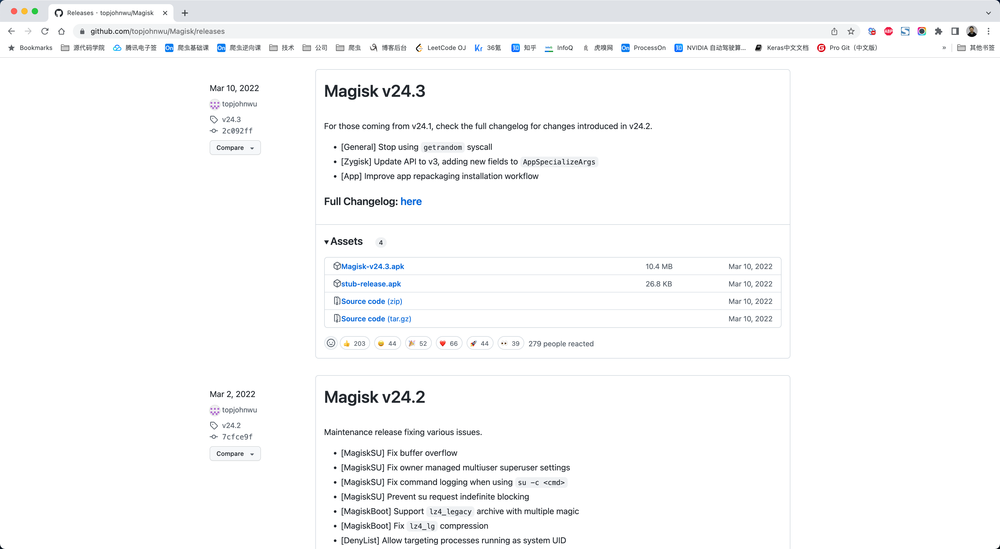
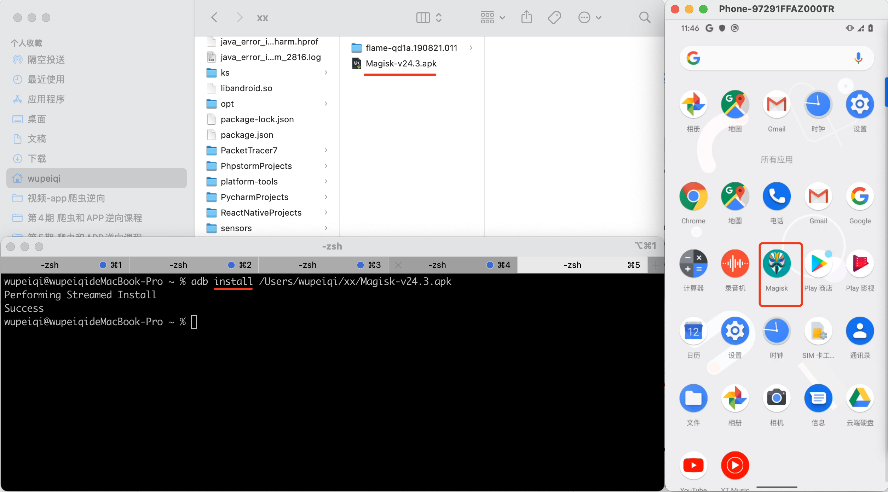
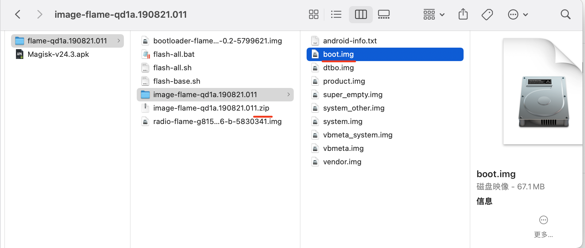
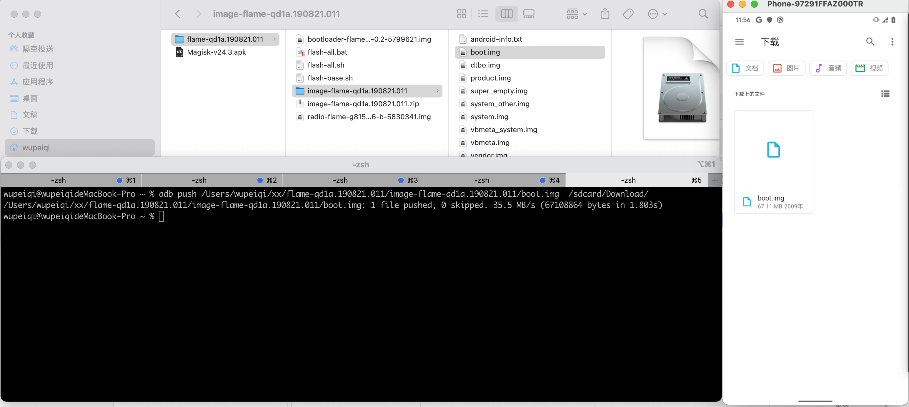
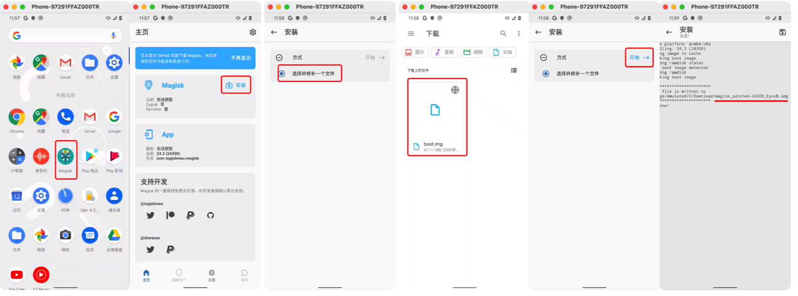
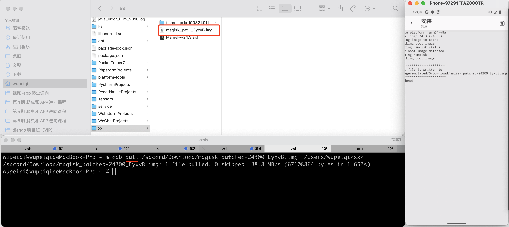
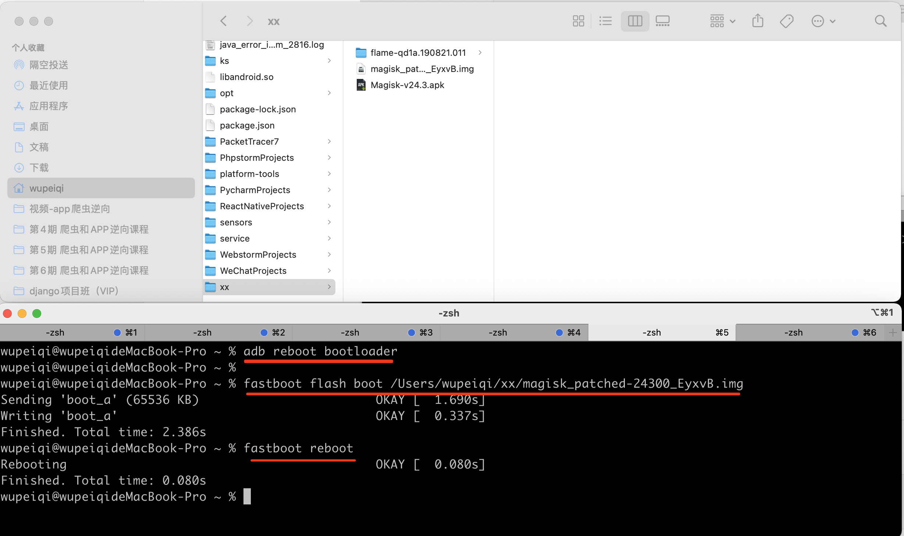
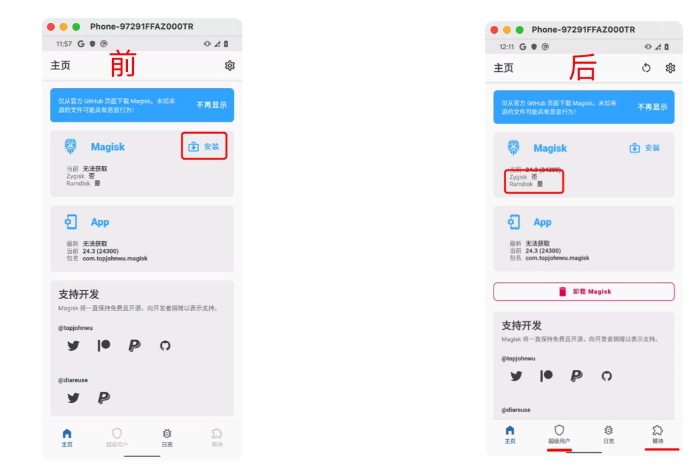

# 谷歌Pixel相关：root手机

Pixel手机相关内容：

- 刷机，官方包。
- **root**，获取root权限。
- 集成charles证书


# 1.安装magisk

下载 magisk.apk 文件，并安装到手机上。

官方：https://github.com/topjohnwu/Magisk/releases

版本：v24.3（课上使用）




可以使用adb快速的在手机上安装APK：

```
>>>adb install APK文件路径
```




# 2.修补boot.img

接下来，需要将上一步刷机的官方包中 `boot.img`，传至手机，再手机中利用 magisk 进行修改，然后再回传至电脑端（用于后续刷机root）


## 2.1 push boot.img

- 先解压官方包中的zip包，找到 boot.img

- 利用adb 命令，将boot.img发到手机的中 `/sdcard/Download/`目录。

  ```
  >>>adb push 电脑boot.img的路径   手机目标路径
  ```

  ```
  >>>adb push  D:\..\..   /sdcard/Download/
  ```







## 2.2 magisk修复

打开magisk，然后对boot.img进行修复。




## 2.3 pull boot.img

将手机上修复好的boot.img再拉回到自己电脑上（任意目录）。

```
>>>adb pull  手机文件路径   本地文件路径
```



注意：如果觉得修复的boot.img文件名太长，也可以自己修改。


# 3.root

对手机进行root，其实就是将新修复的 boot.img 刷入到手机。

```
>>>adb reboot bootloader                    进入bootloader
>>>fastboot flash boot  修复的boot文件		 刷入boot
>>>fastboot reboot         					重启手机
```




对比root前后，打开magisk的不同：




至此，手机root完成。。。


