# 谷歌Pixel相关：https证书

Pixel手机相关内容：

- 刷机，官方包。
- root，获取root权限。
- **https证书**，安装charles证书，实现抓包。


# 1.刷move cert模块

下载move cert模块并刷入到magisk面具中。

作用：可以将手机 `用户级别`证书自动移动到 `系统级别`。

- 安卓7以上，将证书安装在**系统**级别，才能抓https的包。
- 安卓7以下，将证书安装在**用户**级别，就可以抓https的包。


模块已准备好，请大家去随堂课件中获取。

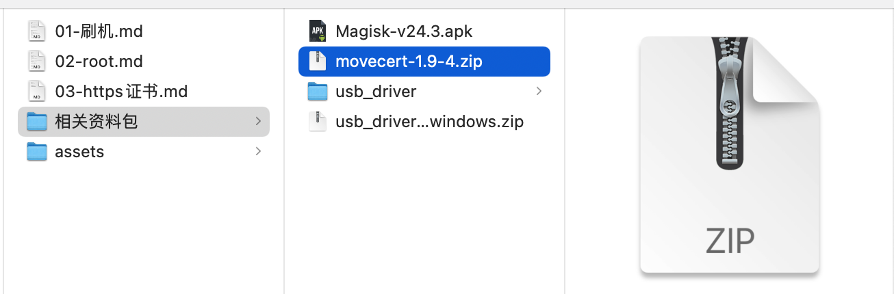


## 1.1 传至手机

将move cert压缩包传到手机（任意好找的一个目录 `/sdcard/Download/`）。

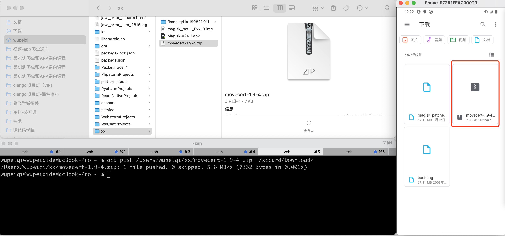


## 1.2 刷模块

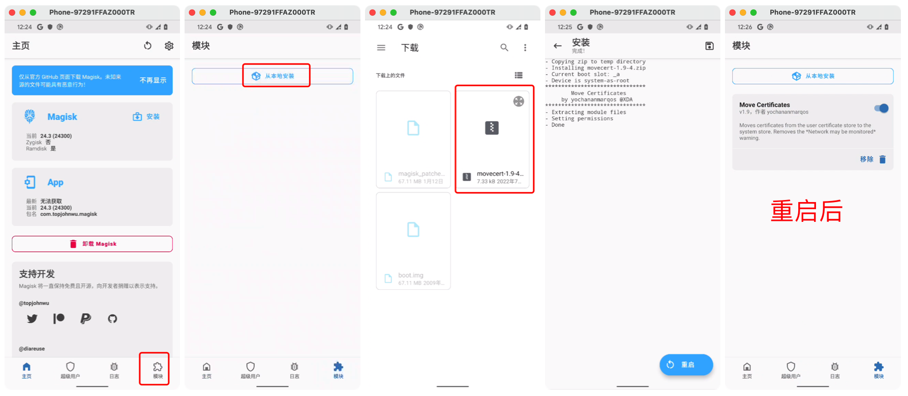


# 2.火狐浏览器

在手机上安装火狐浏览器，后续方便访问charles下载证书（有些机型Pixel自带谷歌浏览器不好使）。

```
>>>adb install xxx/xxx/xx/firefox.apk
```

https://www.wandoujia.com/apps/288613

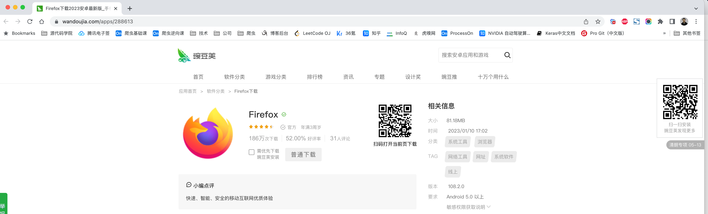

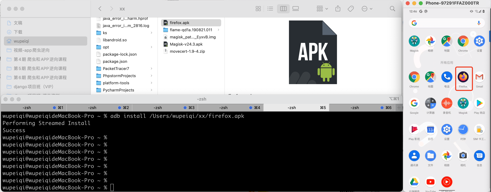


# 3.charles证书

- 打开charles，然后在手机上配置系统代理，再在浏览器上输入  `chls.pro/ssl` 安装用户级别证书
- 重启手机，自动将用户证书放在系统证书中。


## 3.1 charles配置

在安装证书前，请确保自己电脑上charles的配置已完成：

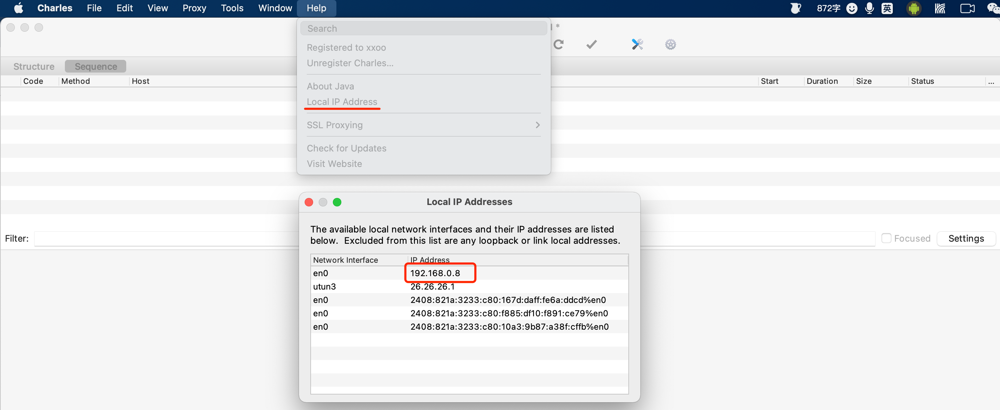

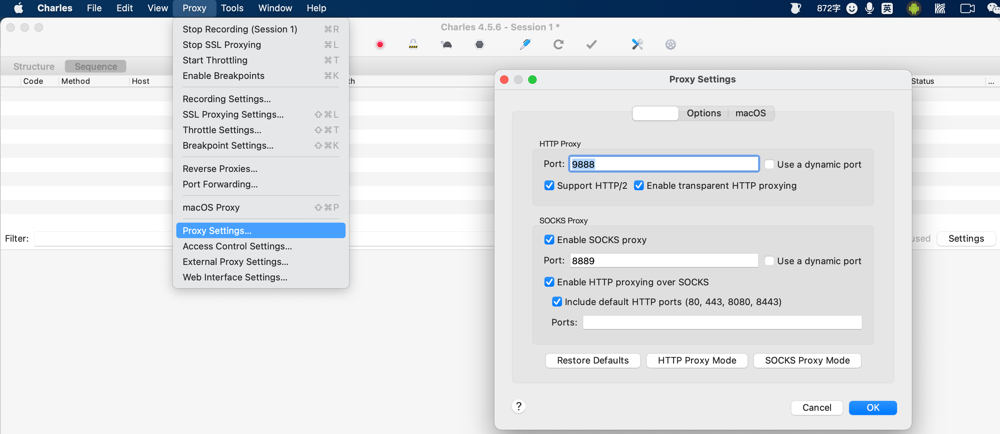


## 2.2 配置代理


## 3.3 安装证书

用浏览器打开网址 `chls.pro/ssl` ，下载并安装 **用户证书**。

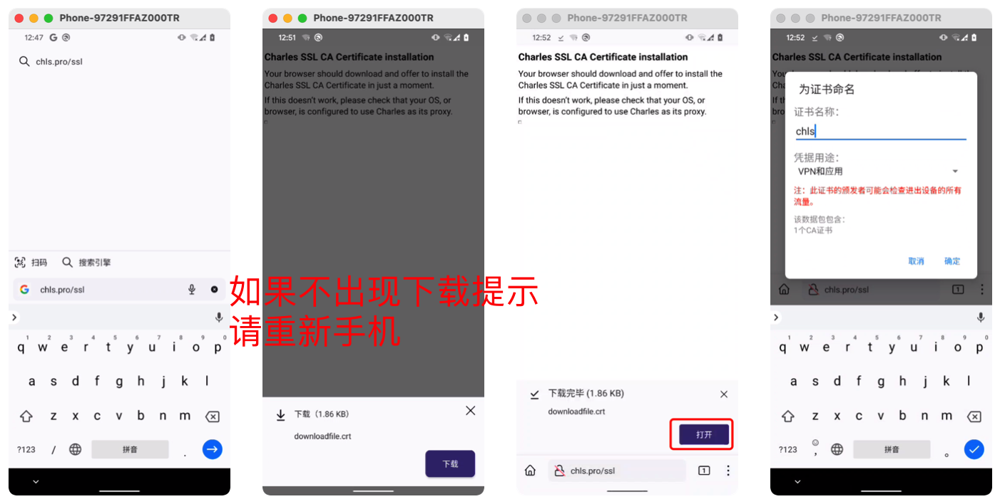


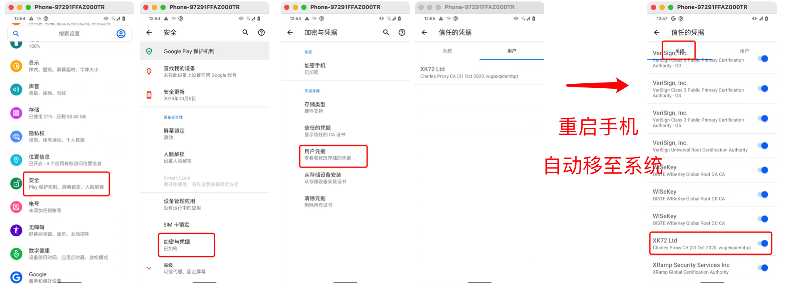


# 4.抓包测试

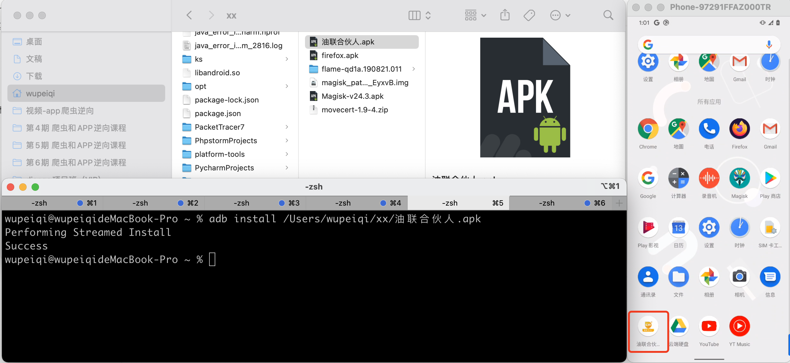


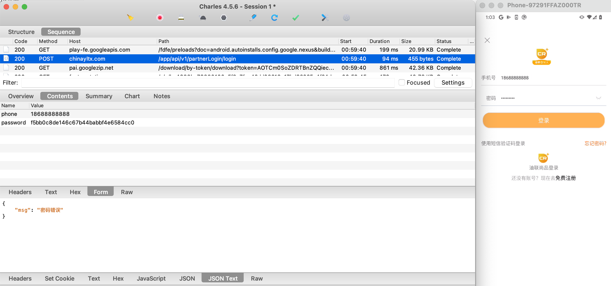


# 结束

Pixel手机相关内容：

- 刷机，官方包。

- root，获取root权限。

- https证书，安装charles证书，实现抓包。

  

后续：xposed、刷定制AOSP系统 等


