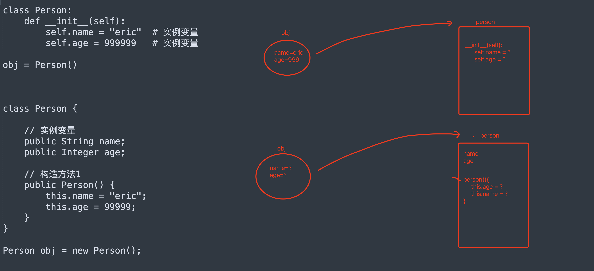

# day09 Java面向对象和加密

**讲师：武沛齐（微信 wupeiqi666）**


- 面向对象 相关（重要）

- 常见加密

  ```python
  - 熟悉Java中的算法实现。
  - Python如何实现。
  - 哪些APP会用到，套路都是怎么样？
  ```


# 1.面向对象相关

- Python，函数式+面向对象。
- Java，面向对象。

## 1.1 类和对象 




```java
class Person {
    // 实例变量
    public String name;
    public Integer age;

    // 构造方法1
    public Person() {
        this.name = "Eric";
        this.age = 99999;
    }
}

Person obj = new Person();
```

```python
class Person:
    
    # 初始化方法，  1. __new__方法，构造方法创建空对象 2.__init___方法
    def __init__(self):
        self.name = "eric"
        self.age = 999999
        
obj = Person()
```

```java
class Person {

    // 实例变量
    public String name;
    public Integer age;
    public String email;

    // 构造方法1
    public Person() {
        this.name = "Eric";
        this.age = 99999;
    }

    // 构造方法2
    public Person(String name, Integer age) {
        this.name = name;
        this.age = age;
        this.email = "xxx@live.com";
    }

    // 构造方法3
    public Person(String name, String email) {
        this.name = name;
        this.age = 83;
        this.email = email;
    }
}

Person obj1 = new Person("wupeiqi",11);
Person obj2 = new Person();
```


```java
class Person {

    // 实例变量
    public String name;
    public Integer age;
    public String email;

    // 构造方法1
    public Person() {
        this.name = "Eric";
        this.age = 99999;
    }

    // 构造方法2
    public Person(String name, Integer age) {
        this.name = name;
        this.age = age;
        this.email = "xxx@live.com";
    }

    // 构造方法3
    public Person(String name, String email) {
        this.name = name;
        this.age = 83;
        this.email = email;
    }
	
    // 定义方法（重载）
    public void doSomething() {
        System.out.println(this.name);
    }

	// 定义方法（重载）
    public void doSomething(String prev) {
        String text = String.format("%s-%s", prev, this.name);
        System.out.println(text);
    }
    
}

public class Hello {

    public static void main(String[] args) {
		
        // 实例化对象时，体现的主要是封装。
        Person p1 = new Person();
        Person p2 = new Person("alex", 73);
        Person p3 = new Person("tony", "alex@sb.com");

        p1.doSomething();
        p1.doSomething("你好呀，");

        p2.doSomething();
        p2.doSomething("你好呀，");
        
        p3.doSomething();
        p3.doSomething("你好呀，");
    }
}
```


## 1.2 静态成员

```python
class Foo:
    v1 = "武沛齐"             # 静态变量（属于类，与对象无关）
    
    def __init__(self):
        self.name = "alex"   # 实例变量，属于对象
        
print(Foo.v1)

# 1.创建空的区域
# 2.自动执行构造方法 __init__
obj = Foo()
print(obj.name)
print(obj.v1)
```


```java
class Person {
    // 静态变量
    public static String city = "北京";
    
    // 实例变量
    public String name;
    public Integer age;

    // 构造方法1
    public Person() {
        this.name = "Eric";
        this.age = 99999;
    }
    
    // 绑定方法
    public void showInfo(){
        System.out.println("哈哈哈哈");
    }
    
    // 静态方法
    public static void showData(){
        System.out.println("哈哈哈哈");
    }
}

Person.city;
Person.showData();

Person obj = new Person();
obj.name;
obj.age;
obj.showInfo();
```

本质：静态属于类；非静态属于对象。


## 1.3 继承

Java中的继承，只支持单**继承**，不支持多继承，但支持**实现**多个接口。

```java
class Base{
    ...
}

class Foo{
    ...
}

class Son(Base){
    
}
```

```java
interface Base{
    public void add();
}

interface Foo{
	public void plus();
}

class Son implements Base,Foo {
    public void add(){
        
    }
    public void plus(){
        
    }
}
```


Python中之和多继承。

```python
class Foo(Base,Bar):
    pass

class Foo(IBase,IBar):
    pass
```


```java
class Base {
    public String email;

    public Base(String email) {
        this.email = email;
    }

    public String getSubInfo() {
        return String.format("%s", this.email);
    }
}


// Base obj1 = new Base("xx");
// obj1.email; // "xx"
// obj1.getSubInfo();

class Person extends Base {

    public String name;
    public Integer age;

    public Person(String name, Integer age, String email) {
        super(email);// 执行父类的构造方法
        
        this.name = name;
        this.age = age;
    }

    public String getInfo(String v1) {
        return String.format("%s-%d-%s", this.name, this.age, this.email);
    }
}

// obj2 ==> email="xxx@live.com"  name="wupeiqi"  age=19
Person obj2 = new Person("wupeiqi",19,"xxx@live.com");

// obj2.name;
// obj2.age;
// obj2.email;

// obj2.getInfo("xxx");
// obj2.getSubInfo();
```


**用父类泛指所有的子类。**

```java
class Base {
    
}

class Person extends Base {

}

Person v1 = new Person(); // v1是Person类型的对象
Base v2 = new Person();  //  v2是Person类型的对象
```

```java
class Base {
    public void show() {
		System.out.println("111");
    }
}

class Person extends Base {
	public void show() {
		System.out.println("222");
    }
}

Person v1 = new Person();
v1.show(); // 222

Base v2 = new Base();
v2.show(); // 111

Base v3 = new Person();
v3.show(); // 222
```


```java
class Base {
    public String email;

    public Base(String email) {
        this.email = email;
    }

    public void getSubInfo() {
		System.out.println("111");
    }
}

// Person类继承Base类
class Person extends Base {

    public String name;

    public Person(String name, Integer age, String email) {
        super(email);// 执行父类的构造方法
        this.name = name;
    }
	
     public void getSubInfo() {
		System.out.println("222");
    }
}

public class Hello {
	
    public static void handler(Base v1){
        v1.getSubInfo();
    }
    
    // 主函数
    public static void main(String[] args) {
        Person obj1 = new Person("wupeiqi",19,"xxx@live.com");
		handler(obj1); // 222

        Base obj2 = new Base("xxx@live.com");
        handler(obj2); // 111

        Base obj3 = new Person("wupeiqi",19,"xxx@live.com");
        handler(obj3); // 222
    }
    
}
```


## 1.4 接口

接口：

- 约束，实现他的类。
- 泛指 `实现` 他了类。

```java
interface IMessage {
    public void send();
}

// Wechat类"实现"了Imessage接口
class Wechat implements IMessage {
    public void send() {
        System.out.println("发送微信");
    }
}

class DingDing implements IMessage {
    public void send() {
        System.out.println("发送钉钉");
    }
}

class Sms implements IMessage {
    public void send() {
        System.out.println("发送短信");
    }
}

Wechat v1 = new Wechat();
IMessage v2 = new Wechat();
```

```java
public class Hello {
    
    // 多态 -> 多种形态 IMessage
	public static void handler(IMessage v1){
        v1.send();
    }
    
    // 主函数
    public static void main(String[] args) {
       Sms v1 = new Sms();
       handler(v1);
    }
}
```


在Java中：不支持同时继承多个类；支持实现多个接口。

```java
interface IPerson {
    public void f1();

    public void f1(int age);

    public void f2(String info);
}

interface IUser {
    public String f3(int num);
}

class Base {
    public String name;
    public Integer age;
    public String email;

    public Base(String name, Integer age, String email) {
        this.name = name;
        this.age = age;
        this.email = email;
    }

    public String getSubInfo() {
        return String.format("%s", this.email);
    }
}

class Person extends Base implements IUser, IPerson {

    public Person(String name, Integer age, String email) {
        super(name, age, email);
    }

    public String getInfo() {
        return String.format("%s-%d-%s", this.name, this.age, this.email);
    }


    public void f1() {
        System.out.println("F1,无参数");
    }

    public void f1(int age) {
        System.out.println("F1,age参数");
    }

    public void f2(String info) {
        System.out.println("F2");
    }

    public String f3(int num) {
        return "哈哈哈";
    }
}

public class Hello {

    public static void main(String[] args) {
        Person p = new Person("日天", 83, "ritian@live.com");
        p.f1();
    }
}
```


假设我现在在进行逆向，拿到apk，关于关键字去搜索：f2 ，定位到一个接口了。

```java
interface IPerson {
    public void f1();

    public void f1(int age);

    public void f2(String info);
}
```

接下来，你就应该去看都有哪些类 实现了 IPerson 接口。

- 只有1个类实现 IPerson。 
- 多类类实现 IPerson 接口，筛选到底是那个类？


## 1.5 抽象

```java
// 抽象类
abstract class Base {

    // 抽象方法（约束子类中必须有这个方法）
    public abstract void play(String name);

    // 普通方法
    public void stop() {
        System.out.println("Stop");
    }
}

class Son extends Base{
    public void play(String name){
        // ...
    }
}

Son obj = new Son();
obj.stop();
obj.play();

Base obj1 = new Son();
```

注意：也可以泛指他的子类。


## 1.6 包

```
src
├── Hello.java
└── utils
    └── Helper.java
```

```java
// hello.java
import utils.Helper;

public class Hello {

    public static void main(String[] args) {
        String data = Helper.getInfo();
        System.out.println(data);
    }
}

```

```java
// helper.java
package utils;

public class Helper {
    public static String getInfo() {
        return "哈哈哈";
    }
}
```


**类的修饰符：**

- public，公共（任何人都能调用包中的类）。
- default，只能在当前包中被调用。


**类成员修饰符：**

- public，公共，所有的只要有权限访问类，类中的成员都可以访问到。
- private，私有，只允许自己类调用。
- protected，同一个包 或 子类可以访问（即使没有在同一个包内，也可以访问父类中的受保护成员）。
- default，只能在同一个包内访问。


目的：通过关键字让调用关系更加清晰（不过，很多项目不会用的那么专业）。


## 1.7 属性

```java
class Person {

    private String name;

    public Person() {
        this.name = "eric";
    }


    public void setName(String data){
        this.name = data;
    }

    public String getName(){
        return this.name;
    }
}


Person obj = new Person();
obj.getName()
obj.setName("武沛齐")

-----------------------------------

class Person {
    private String name;

    public void setName(String data){
        this.name = data;
    }

    public String getName(){
        return this.name;
    }
}


Person obj = new Person();
obj.getName();
```


# 2.常见加密


## 2.1 隐藏字节

```java
String salt = "xxssasdfasdfadsf";
```

```java
String v4 = new String(new byte[]{-26, -83, -90, -26, -78, -101, -23, -67, -112});
```

- 示例1：

  ```java
  String v1 = new String(new byte[]{26, 83, 90, 26, 78, 101, 23, 67, 112});
  ```

  ```python
  # 字节列表
  byte_list = [26, 83, 90, 26, 78, 101, 23, 67, 112]
  
  # 字节列表 -> python的字节数组
  bs = bytearray()
  for item in byte_list:
      bs.append(item)
      
  # python的字节数组 -> 编码 -> 字符串
  str_data = bs.decode('utf-8')
  print(str_data)
  ```

- 示例2：

  ```java
  String v4 = new String(new byte[]{-26, -83, -90, -26, -78, -101, -23, -67, -112});
  
  # java字节：有符号 -128 ~ 127
  # python：无符号  0 ~ 255
  ```

  ```python
  byte_list = [-26, -83, -90, -26, -78, -101, -23, -67, -112]
  
  bs = bytearray()  # python字节数组
  for item in byte_list:
      if item < 0:
          item = item + 256
      bs.append(item)
  
  str_data = bs.decode('utf-8')  # data = bytes(bs)
  print(str_data)
  ```

  

```
注意事项：什么编码？（utf-8)
	String v4 = new String(new byte[]{-26, -83, -90, -26, -78, -101, -23, -67, -112});
```

```python
# 类似于Java中的字节数组
data = "张三懵逼了"
data_bytes = data.encode('utf-8')


data_list = bytearray()
for item in data_bytes:
    data_list.append(item)

res = data_list.decode('utf-8')
print(res)
```


提醒：MD5加密盐、AES加密key、iv;


## 2.2 uuid


```java
import java.util.UUID;

public class Hello {
    public static void main(String[] args){
        String uid = UUID.randomUUID().toString();
        System.out.println(uid);
    }
}
```

```python
import uuid

uid = str(uuid.uuid4())
print(uid)
```


## 2.3 随机值


```java
import java.math.BigInteger;
import java.security.SecureRandom;

public class Hello {

    public static void main(String[] args) {
        // 随机生成80位，10个字节
        BigInteger v4 = new BigInteger(80, new SecureRandom());
        // 让字节以16进制展示
        String res = v4.toString(16);
        System.out.println(res);

    }
}
```

```python
import random

data = random.randbytes(10)  # python3.9

ele_list = []
for item in data:
    ele = hex(item)[2:]
res = "".join(ele_list)
print(res)
```

```python
data = "".join([ hex(item)[2:] for item in random.randbytes(10)])
```

```python
import random

data = random.randbytes(10)  # pytho3.9  [199,112,88,10,232]

print(  [item for item in data]  )
print(  [hex(item)[2:] for item in data]  )
print(  [hex(item)[2:].rjust(2, "0") for item in data]   )


print(  "".join([hex(item)[2:].rjust(2, "0") for item in data])   )
```


```python
import random

byte_list = [random.randint(0, 255) for i in range(10)]


print([item for item in byte_list])
print([hex(item)[2:] for item in byte_list])
print([hex(item)[2:].rjust(2, "0") for item in byte_list])

print("".join([hex(item)[2:].rjust(2, "0") for item in byte_list]))
```


#### 小补充：十六进制

```python
import random

data = random.randbytes(10)  # pytho3.9

ele_list = []
for item in data:
    ele = hex(item)[2:].rjust(2,"0")
res = "".join(ele_list)
print(res)
```

```python
data = "".join([ hex(item)[2:].rjust(2,"0") for item in random.randbytes(10)])
```


注意：md5加密

- Python中的md5加密：   digest   hexdigest
- Java中的的md5加密：字节数组  -> 手动转换


## 2.4 时间戳

_ticket


```java
public class Hello {

    public static void main(String[] args) {
        String t1 = String.valueOf(System.currentTimeMillis() / 1000);
        String t2 = String.valueOf(System.currentTimeMillis());

        System.out.println(t1);
        System.out.println(t2);
    }
}
```

```python
import time

v1 = int(time.time())
v2 = int(time.time()*1000)
```

```python
v1 = str(int(time.time()))
v2 = str(int(time.time()*1000))
```

```python
requests.post(
	url="?"
    json={
        "xx":123
    },
    headers={
        "ticket":121231   # 报错，一定是字符串类型
    }
)
```


## 2.5 十六进制的字符串


在Java中字节是有符号：-128 ~ 127 

```python
# name_bytes = "武沛齐".encode('utf-8')
name_bytes = [10, -26, -83, -90, -26, -78, -101, -23, -67, -112]

data_list = []

for item in name_bytes:
    item = item & 0xff   # item<0时，让item+256
    ele = "%02x" % item
    data_list.append(ele)
    
print("".join(data_list))
```


## 2.6 md5加密

```python
import hashlib

obj = hashlib.md5('yyy'.encode('utf-8'))
obj.update('xxxxx'.encode('utf-8'))

# java中没有这个功能。
v1 = obj.hexdigest()
print(v1) # fb0e22c79ac75679e9881e6ba183b354

v2 = obj.digest()
print(v2) # b'\xfb\x0e"\xc7\x9a\xc7Vy\xe9\x88\x1ek\xa1\x83\xb3T'
```


```java
import java.security.MessageDigest;
import java.security.NoSuchAlgorithmException;
import java.util.Arrays;
import java.util.Base64;

public class Hello {

    public static void main(String[] args) throws NoSuchAlgorithmException {
        String name = "武沛齐";
        
        MessageDigest instance = MessageDigest.getInstance("MD5");
        byte[] nameBytes = instance.digest(name.getBytes());
       
        // 十六进制展示
        StringBuilder sb = new StringBuilder();
        for(int i=0;i<nameBytes.length;i++){
            int val = nameBytes[i] & 255;  // 负数转换为正数
            if (val<16){
                sb.append("0");
            }
            sb.append(Integer.toHexString(val));
        }
        String hexData = sb.toString();
        System.out.println(hexData); // e6ada6e6b29be9bd90
    }
}
```

```python
import hashlib

m = hashlib.md5()
m.update("武沛齐".encode("utf-8"))

v1 = m.digest()
print(v1) # b'\x175\x10\x12G$)\xd5-\x0c\r#\xd4h\x17='

v2 = m.hexdigest()
print(v2) # 17351012472429d52d0c0d23d468173d
```


关于加盐：

```java
import java.security.MessageDigest;
import java.security.NoSuchAlgorithmException;
import java.util.Arrays;
import java.util.Base64;

public class Hello {

    public static void main(String[] args) throws NoSuchAlgorithmException {
        String name = "武沛齐";
        MessageDigest instance = MessageDigest.getInstance("MD5");
        instance.update("xxxxxx".getBytes());
        
        byte[] nameBytes = instance.digest(name.getBytes());
        
        System.out.println(Arrays.toString(nameBytes));

        String res = new String(nameBytes);
        System.out.println(res);

        // 十六进制展示
        StringBuilder sb = new StringBuilder();
        for(int i=0;i<nameBytes.length;i++){
            int val = nameBytes[i] & 255;  // 负数转换为正数
            if (val<16){
                sb.append("0");
            }
            sb.append(Integer.toHexString(val));
        }
        String hexData = sb.toString();
        System.out.println(hexData); // e6ada6e6b29be9bd90
    }
}
```


```java
import hashlib

m = hashlib.md5("xxxxxx".encode('utf-8'))
m.update("武沛齐".encode("utf-8"))

v2 = m.hexdigest()
print(v2) # 17351012472429d52d0c0d23d468173d
```


## 2.7 sha-256加密

B站：x/report/andriod2，请求体


```java
import java.security.MessageDigest;
import java.security.NoSuchAlgorithmException;
import java.util.Arrays;
import java.util.Base64;

public class Hello {

    public static void main(String[] args) throws NoSuchAlgorithmException {
        String name = "武沛齐";
        MessageDigest instance = MessageDigest.getInstance("SHA-256");
        byte[] nameBytes = instance.digest(name.getBytes());
        // System.out.println(Arrays.toString(nameBytes));

        // String res = new String(nameBytes);
        // System.out.println(res);

        // 十六进制展示
        StringBuilder sb = new StringBuilder();
        for(int i=0;i<nameBytes.length;i++){
            int val = nameBytes[i] & 255;  // 负数转换为正数
            if (val<16){
                sb.append("0");
            }
            sb.append(Integer.toHexString(val));
        }
        String hexData = sb.toString();
        System.out.println(hexData); // e6ada6e6b29be9bd90
    }
}
```

```python
import hashlib

m = hashlib.sha256()
m.update("武沛齐".encode("utf-8"))

v2 = m.hexdigest()
print(v2)
```


## 2.8 AES加密

对称加密

- key & iv ，明文加密。【app端】
- key & iv ，解密。【API】

```
情况A: 请求体密文（抓包乱码）
情况B: sign，AES加密+base64编码
```

刷B站播放时，发送POST请求。

AES加密（请求体中的数据） -> 密文（JS央视频 key & iv & 加密）。


```java
import javax.crypto.BadPaddingException;
import javax.crypto.Cipher;
import javax.crypto.IllegalBlockSizeException;
import javax.crypto.NoSuchPaddingException;
import javax.crypto.spec.IvParameterSpec;
import javax.crypto.spec.SecretKeySpec;
import java.io.UnsupportedEncodingException;
import java.security.InvalidAlgorithmParameterException;
import java.security.InvalidKeyException;
import java.security.MessageDigest;
import java.security.NoSuchAlgorithmException;
import java.util.Arrays;
import java.util.Base64;

public class Hello {

    public static void main(String[] args) throws Exception {
        String data = "武沛齐";
        String key = "fd6b639dbcff0c2a1b03b389ec763c4b";
        String iv = "77b07a672d57d64c";
		
        Cipher cipher = Cipher.getInstance("AES/CBC/PKCS5Padding");
        
        // 加密
        byte[] raw = key.getBytes();
        SecretKeySpec skeySpec = new SecretKeySpec(raw, "AES");
        IvParameterSpec ivSpec = new IvParameterSpec(iv.getBytes());
        
        
        
        cipher.init(Cipher.ENCRYPT_MODE, skeySpec, ivSpec);
        byte[] encrypted = cipher.doFinal(data.getBytes());
        
        // System.out.println(Arrays.toString(encrypted));
        
    }
}
```

```python
# pip install pycryptodome
from Crypto.Cipher import AES
from Crypto.Util.Padding import pad

KEY = "fd6b639dbcff0c2a1b03b389ec763c4b"
IV = "77b07a672d57d64c"


def aes_encrypt(data_string):
    aes = AES.new(
        key=KEY.encode('utf-8'),
        mode=AES.MODE_CBC,
        iv=IV.encode('utf-8')
    )
    raw = pad(data_string.encode('utf-8'), 16)
    return aes.encrypt(raw)

data = aes_encrypt("武沛齐")
print(data)
print([ i for i in data])

```


## 2.9 base64编码

```java
import java.util.Base64;

public class Hello {

    public static void main(String[] args) {
        String name = "武沛齐";
        // 编码
        Base64.Encoder encoder  = Base64.getEncoder();
        String res = encoder.encodeToString(name.getBytes());
        System.out.println(res); // "5q2m5rKb6b2Q"
		
        // 解码
        Base64.Decoder decoder  = Base64.getDecoder();
        byte[] origin = decoder.decode(res);
        String data = new String(origin);
        System.out.println(data); // 武沛齐

    }
}
```

```python
import base64

name = "武沛齐"

res = base64.b64encode(name.encode('utf-8'))
print(res) # b'5q2m5rKb6b2Q'


data = base64.b64decode(res)
origin = data.decode('utf-8')
print(origin) # "武沛齐"


# 不同，换行符 + ==
```


